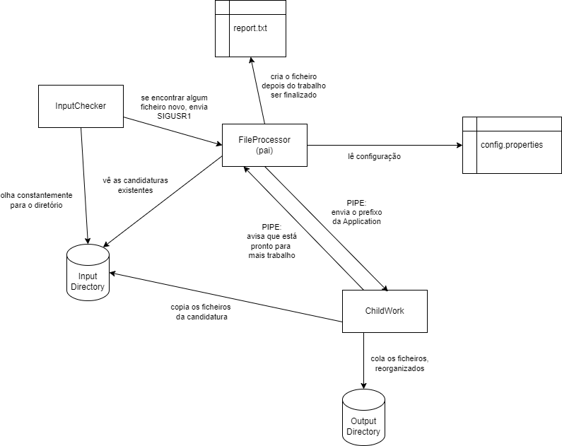

# *Sprint Review* - Sprint B de SCOMP

Neste documento, encontra-se o seguinte conteúdo:
* Percentagem de contribuição de cada elemento do grupo no sprint;
* As funcionalidades implementadas e a respectiva percentagem funcional;
* Nos casos em que uma funcionalidade esteja 100% implementada de acordo com o previsto, devem ser indicadas todas as situações que determinam essa percentagem;
* Um diagrama que explique os diversos componentes usados e as suas interacções;
* Outros aspetos importantes.

## Percentagem de contribuição:

| Aluno                        | Percentagem de contribuição (%) |
|------------------------------|---------------------------------|
| 1190378 - (André Ferreira)   | 20                              |
| 1220741 - (Bernardo Barbosa) | 20                              |
| 1221071 - (Diogo Cunha)      | 40                              |
| 1221948 - (Tomás Peixoto)    | 20                              |

## Funcionalidades implementadas

| Funcionalidade                                                                                                 | Percentagem funcional (%) |
|----------------------------------------------------------------------------------------------------------------|---------------------------|
| Leitura regular do diretório de *input*                                                                        | 100                       |
| Cópia dos ficheiros para o diretório de *output*, organizados pela *Job Reference* e pelo *Application Number* | 100                       |
| Geração de um *report* quando o programa finaliza a cópia dos ficheiros para o diretório de *output*           | 100                       |

## Situações de erro

Nada a anotar

## Diagrama de componentes

Este diagrama representa as relações entre as várias componentes na nossa implementação do Application File Bot.

## Outros aspetos

Nada a anotar