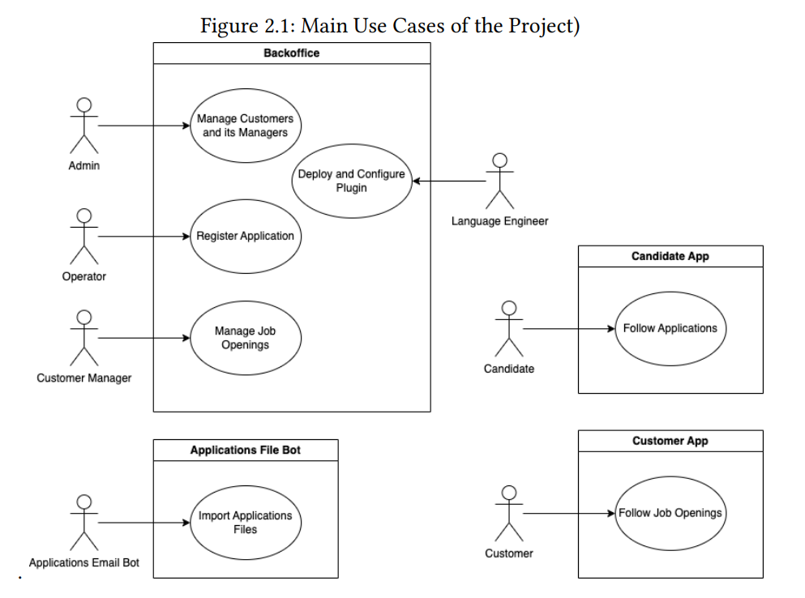

# US G003

## 1. Context

* This US was assigned during the first **Sprint** as part of its setup process.

## 2. Requirements

**US G003** As Project Manager, I want the team to configure the project structure to facilitate/accelerate the development of upcoming user stories.

**Acceptance Criteria:**

- G003.1. The team should setup the project's modules in accordance to its use cases.
- G003.2. The team should also add the necessary dependencies to be used in future functionalities.

**Dependencies/References:**

* Define the structure of the project to support the envisioned architecture, such as presented in Chapter 4, including support for adopted technologies (e.g., ANTLR).

## 3. Analysis

* The team analyzed the project's various roles and created modules in accordance.

    
    Thus, the domain modules are the following:
  * **backoffice** (the roles will be managed with the not yet developed authorization system), 
  * **candidate**,
  * **customer**.
* The team also added the following dependencies:
  * **ANTLR** (mentioned in this US's Dependencies/References)
    * From: https://mvnrepository.com/artifact/org.antlr/antlr4-runtime/4.13.1
  * **H2 database** (mentioned in **NFR07**)
    * From: https://mvnrepository.com/artifact/com.h2database/h2/2.2.224

## 4. Design

* Design is not applicable to this US.

## 5. Implementation

* Implementation is not applicable to this US.

## 6. Integration/Demonstration

* Integration/Demonstration is not applicable to this US.

## 7. Observations

* The relational database (RDB) chosen to fulfill **NFR07** was **H2 Database**, as shown previously.