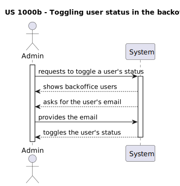
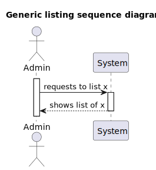

# US 1000
### As Administrator, I want to be able to register, disable/enable, and list users of the Backoffice. Alternatively this can be achieved by a bootstrap process.

## 1. Context

* This US was assigned during the second **Sprint**.

## 2. Requirements

**Acceptance Criteria:**

The Admin menu in the backoffice must contain the ability to manage users in the way described in the user story, and they must all be functional.

This User Story contains 3 different functionalities at once:
* 1000a - registering users
* 1000b - (toggling)disabling/enabling users
* 1000c - listing users

Thus, this is what the team envisioned the US would act like:




 1000c follows the sequence represented by this generic listing diagram, in which x represents the users of the backoffice.



Futhermore, there can only be one admin, and as such, the admin can only register customer managers, operators and language engineers(in the context of this user story).

**Dependencies/References:**

* "Alternatively this can be achieved by a bootstrap process"

## 3. Analysis

The domain model does not include any of the necessary classes for the functionalities of this User Story, since it isn't part of the business concept/model. This also means there is no need to extend the domain model.

## 4. Design

This user story is fairly simple, not having required many design decisions besides the natural, most direct way of achieveing the required objectives. There is one single decision which could arguably be discarded, but was made in order to make the program as easy to use as possible: the way enabçling and disabling users of the backoffice works. 

A user can either be enabled or disabled. Moreover, to make it easier for the uer to take the desired action, it is best to show all the users they could change status of. This is what led us to decide that disabling or enabling a user from the back office is a toggle. That is, the Admin can decide to change the status of one of the displayed users and it will change to whichever one is not the state it is in at the time. For example, an enabled user would be become disabled, and vice-versa.


1000c follows the sequence represented by this generic listing diagram, in which:
* Actor represents the Admin;
* x represents the users of the backoffice;
* UI represents the ListBackofficeUserUI;
* getX() represents the getBackofficeUsers() method from the controller;
* Controller represents the ListBackOfficeUserController;
* x() represents the backofficeUsers() method from the repository;
* Repository represents the Jobs4uUserRepository.


## 5. Implementation

Besides all other documented decisions, there is no new information to display in ths section of the document.

## 5.1. Tests

* Some tests were built in order to verify if the use case (the users being registered/disabled/enabled - listing doesn't require tests) is met:

```
    @Test
    void toggleStatus_shouldToggleUserStatus() {
        Username username = Username.valueOf("test_user");
        Password password = new Password("test_password");
        EmailAddress email = EmailAddress.valueOf("test@example.com");
        Jobs4uUserRoles role = Jobs4uUserRoles.CANDIDATE;
        boolean isEnabled = true;
        Jobs4uUser user = new Jobs4uUser(username, password, email, role, isEnabled);

        user.toggleStatus();

        assertFalse(user.isEnabled());
    }
```

```
  @Test
  void constructor_shouldCreateJobs4uUserObject() {
  Username username = Username.valueOf("test_user");
  Password password = new Password("test_password");
  EmailAddress email = EmailAddress.valueOf("test@example.com");
  Jobs4uUserRoles role = Jobs4uUserRoles.CANDIDATE;
  boolean isEnabled = true;

        Jobs4uUser user = new Jobs4uUser(username, password, email, role, isEnabled);

        assertNotNull(user);
        assertEquals(username, user.getUsername());
        assertEquals(password, user.getPassword());
        assertEquals(email, user.getEmail());
        assertEquals(role, user.getRole());
        assertEquals(isEnabled, user.isEnabled());
  }
```

* The team also developed other unit tests to see if the other components used in this US are working as intended:

```
    @Test
    void toString_shouldReturnStringRepresentation() {
        Username username = Username.valueOf("test_user");
        Password password = new Password("test_password");
        EmailAddress email = EmailAddress.valueOf("test@example.com");
        Jobs4uUserRoles role = Jobs4uUserRoles.CANDIDATE;
        boolean isEnabled = true;
        Jobs4uUser user = new Jobs4uUser(username, password, email, role, isEnabled);

        String result = user.toString();

        assertNotNull(result);
        assertTrue(result.contains("username=test_user"));
        assertTrue(result.contains("password="));
        assertTrue(result.contains("email=test@example.com"));
        assertTrue(result.contains("role=USER"));
        assertTrue(result.contains("isEnabled=true"));
    }
```

## 6. Integration/Demonstration

* TODO

## 7. Observations

Some key information to remember is that, as mentioned before, this User story consists of 3 different functionalities, separate from each other, even if they all relate to the same concept - the backoffice users.

It is also important to know that talks with the client made it clear that there can only be one admin, which means that in the act of registering a backoffice user, there is one type of user who is excluded - the admin, as there already is an admin established and registered by the bootstrap.