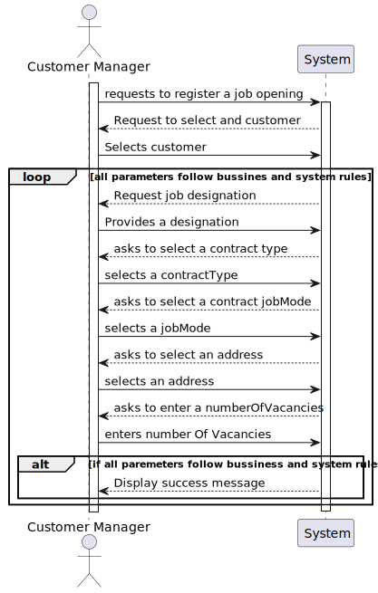
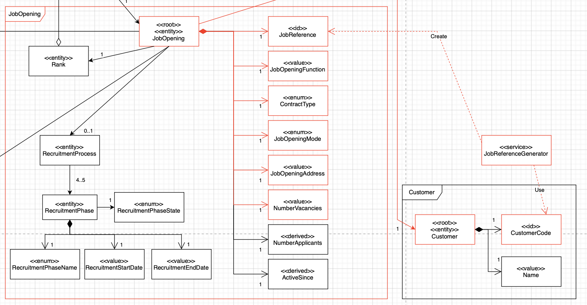
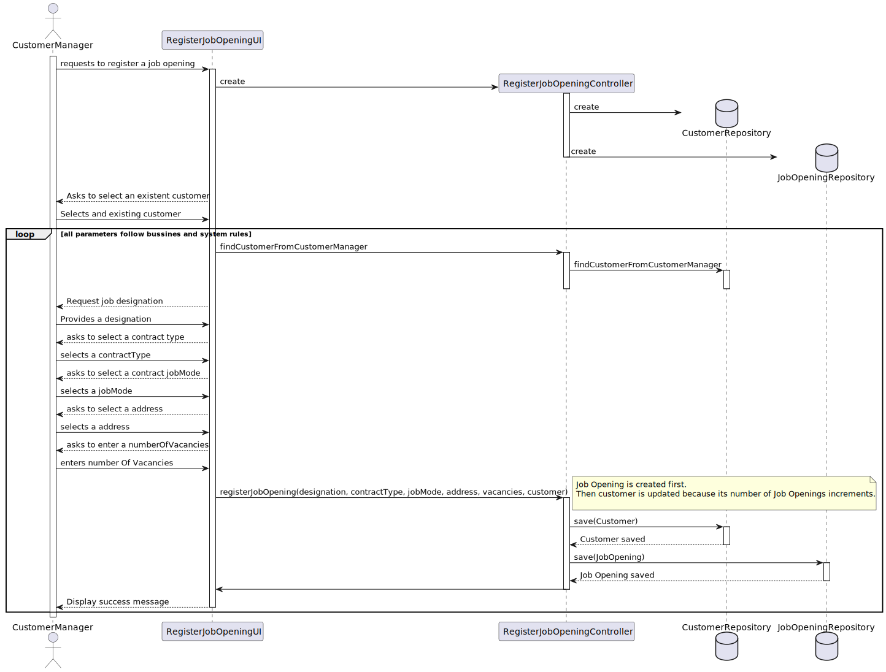

# US 1002 - As Customer Manager, I want to register a job opening. 

## 1. Context

* This US was assigned during the second **Sprint**, as part of the Job Opening setup.

## 2. Requirements

**Acceptance Criteria:**

* 1002.1. A  *Job Opening* must be verified the register on the database.
* 1002.2. The team must ensure that the *Job Opening* is setup correctly.

* **Client Demand:** 1002.3. The team must ensure that the number of *Job Openings* associated with its respective *Customer* is incremented (due to the criteria for the *Job Reference* generation).

Thus, this is what the team envisioned the US would act like:

Futhermore, there can only be one admin, and as such, the admin can only register customer managers, operators and language engineers (in the context of this user story).

**Dependencies/References:**

* "Alternatively this can be achieved by a bootstrap process"

## 3. Analysis

* The domain model includes everything that's needed in order to perform this *US* as needed.
 - The main responsability is atributed to the Job Opening:
 - Though the Customer needs to exist before

## Main Domain/Bussines Rules

- Job Reference has to follow the current domain Policy assured on the **JobReferenceGenerator Service**:
- JobReference is a combination of the customer followed by '_' and a unique sequencial number.

**Note:** The '**active since**' parameter is automatically set to the job opening's creation date.It is not entered manually by the customer manager.

**Note 2:** The '**Number of Applicants**' as indicated by the domain model is **derived** which means it can be achieved by a query,therefore it isnt relevant for this user story.

* The sections in red show what is related to this *US* :

## 4. Design

### Responsibilitys:

**Creating Job Reference** — This is handled by the JobReferenceGenerator Service.

**Selecting a Customer** -The team decided that it would be more efficient for users to select the **Customer** for a Job Opening since this aligns with the responsibility of registering a customer, as referenced in other user stories.

**Customer Longetude of User** -- A **Customer Manager** may manage a large number of **Customers** and should be able to list all of them at once. This is crucial for knowing which **Customer** is linked to the creation of a particular Job Opening.

**Tracking Number of Customer Job Openings to ensure Sequential Number:** After a Job Opening is created, the respective **Customer's** "Number of Job Openings" should be incremented.

Thus, this is what the team envisioned the US would act like:

## 5. Tests

* Tests were performed in order to know if the *Job Opening* object is created as it should be. These tests include:
  * If a *Job Opening* is correctly created;
  * If a *Job Opening* has an existing customer;
  * If all jobOpenings have different job references;
  * If a *Job Opening* at least has:
    * Contract Type;
    * Mode;
    * Address;
    * Function;
    * Customer;
    * Active since;
    * Number of vacancies.

## 6. Implementation

* Nothing to say here

## 7. Integration/Demonstration

* This *US* is integrated into the rest of the project by the *Customer Manager's Menu*.

## 8. Observations
This follwing document was updated after Sprint 2 feedback.
