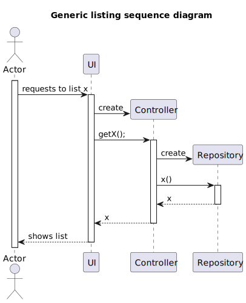

# US 1003: As Customer Manager, I want to list job openings.

## 1. Context

* This US was assigned during the second **Sprint**, as part of the *Listing USs*.

## 2. Requirements

**Acceptance Criteria:**

* 1003.1. The team must ensure that the *Job Openings* are listed correctly.
* 1003.2. The team must ensure that the user can filter the results by customer correctly .

Thus, the team concluded that this *US* follows the **Generic System Sequence Diagram**, "x" being *Job Openings*:

Futhermore, the team also added the option to filter the results by **Customer**.

**Dependencies/References:**

* **User story 1002**: register JobOpening.
* **User story 1001** : register customer (since 1002 depends on 1001)

## 3. Analysis

* The domain model includes everything that's needed in order to perform this *US* as needed.

## 4. Design

* The team decided the results should also show optional attributes. This way, the user can view if those have been set or not.

Thus, the team concluded that this *US* follows the **Generic Sequence Diagram**:

## 5. Tests

* The team decided that it wasn't necessary to perform any unit tests to therefore be no Bussines rules verified here.

## 6. Implementation

* There was no implementantion to do to therefore this us being a listing user story.
* Yet we did add a small feature which allows the user (customer manager) to filter its selection by customer: 

## 7. Integration/Demonstration

* This *US* is integrated into the rest of the project by the *Customer Manager's Menu*.

####  List a Job Opening

*  Filtering by the Customer:

*  Filtering by the Customer:

  
  

## 8. Observations

* It is important to know that then customer manager not att job opening but only list its own job Openings.This information was asked specified by the client.