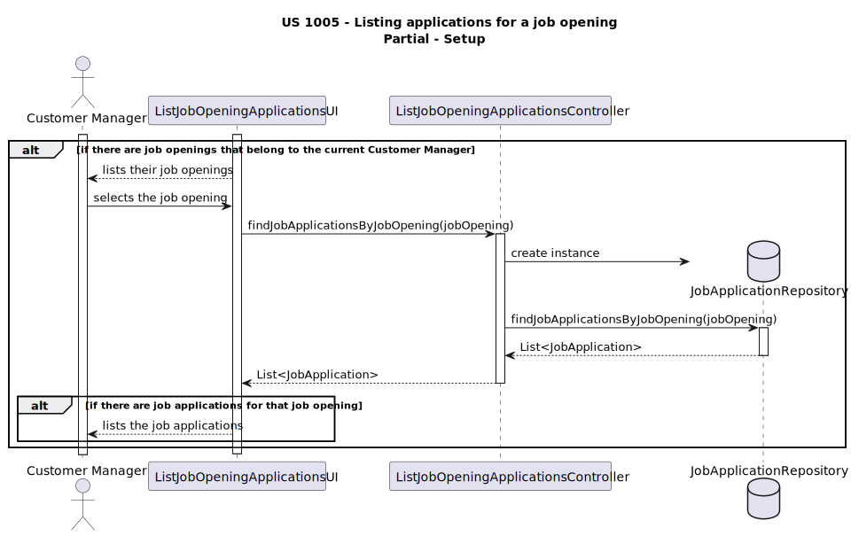
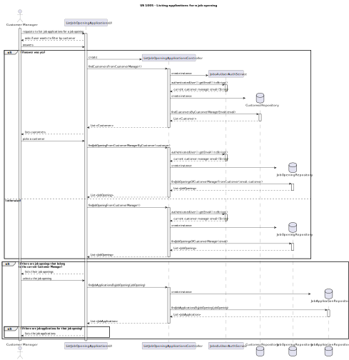

# US 1005

## 1. Context

* This US was assigned during the second **Sprint** as part of the *Listing User Stories*.

## 2. Requirements

**US 1005** As Customer Manager, I want to list all applications for a job opening.

**Acceptance Criteria:**

* 1005.1. The program should be able to list all *job applications* for one *job opening*
* 1005.2. The customer manager should only be able to choose between their *job openings*.

Thus, this is what the team envisioned this *US* to look like:

## 3. Analysis

* The team analyzed the project's various roles and concluded that the current domain model was enough to satisfy this *US*.
* The sections in red show what is related to this *US*:

### Partial Diagram - Setup

### Partial Diagram - Finding an Opening

### Partial Diagram - Finale

## 4. Design

* Thinking about how this *US* would be implemented, the team created a new **UI** (**ListJobOpeningApplicationsUI**) and **Controller** (**ListJobOpeningApplicationsController**) in accordance.
* This *US* also needs access to the **JobOpeningRepository** and **JobApplicationRepository**.
* In order to know what is the current *Customer Manager* using the system, it also needs access to **Jobs4uUserAuthService**.

## 5. Implementation

* Nothing to say here.

## 6. Integration/Demonstration

* This **UI** gets integrated into the rest of the project by the *Customer Manager's Menu*.

## 7. Observations

* N/A