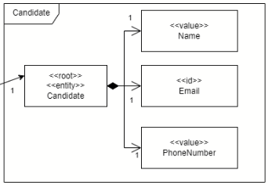
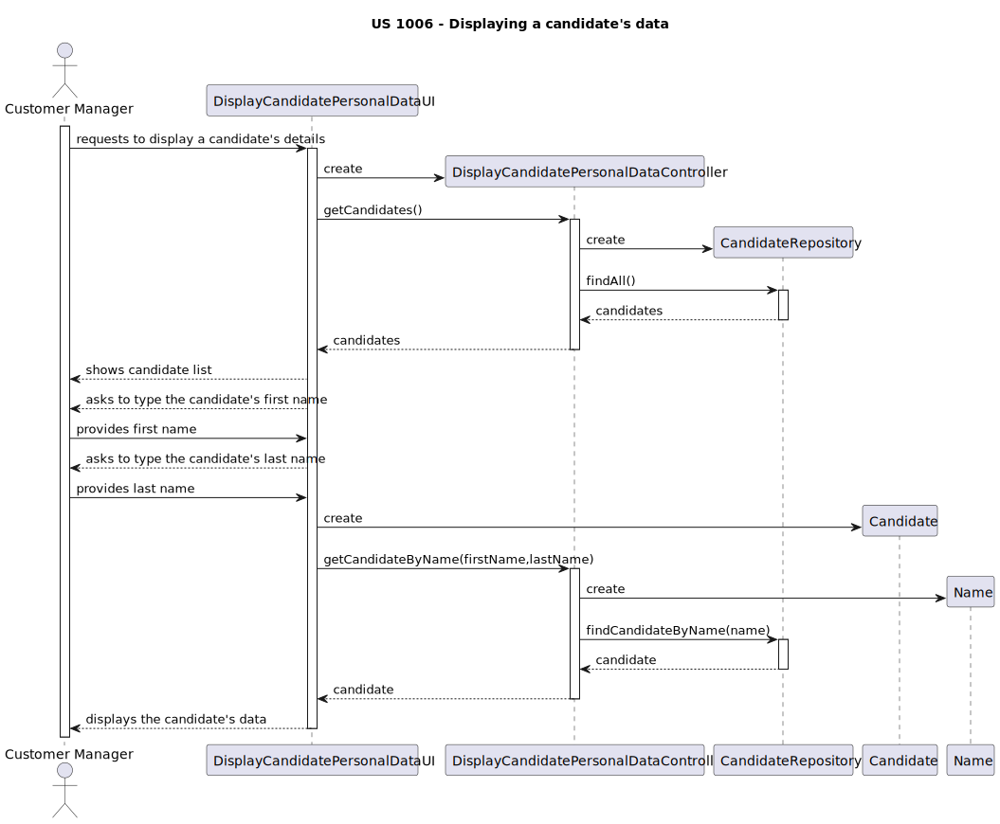

# US 1006

### As Customer Manager, I want to display all the personal data of a candidate.
## 1. Context

* This US was assigned during the second **Sprint**.

## 2. Requirements

**Acceptance Criteria:**

All data registered about a candidate is considered personal data.

Thus, this is what the team envisioned the US would act like:


**Dependencies/References:**

* "Just the candidate details."

## 3. Analysis

This User Story's requirements are fulfilled by the design envisioned in the Domain Model. In the picture below, it is clear that the Candidate class knows its corresponding Name, Email and PhoneNumber classes. It is due to this relationship between classes that we can show the candidate's details, as required.



## 4. Design

During the design process of this User Story, some decisions were made so that this fucntionality could be as user friendly as possible, while fulfilling its main purpose.

Firstly, putting ourselves in the shoes of the user, in this case the Customer Manager, we realized that it would be important for them to able to see which candidates are available to check the details of. Giving the user all the information they might need to make a decision is crucial, and as such we thought it would be important to display all the candidates' names in a list, which is the most common way for people to identify each other.

After the Customer Manager inputs the name and last name of the candidate, the program will find the candidate through their name and display all of their personal information.

This system is flawed, as there might be repeated names. It is not all too uncommon for this to occur. There might be need to change the identifying characteristic of the candidate in this user story to the email for example, or to give the customer manager the option to select whether they want to input an email or a phone number, as they might have outside contact with the candidate and be more familiar with one of these options. Regardless, we made the decision of using the name of the candidate because we thought it would be more intuitive and make more sense from the perspective of an user. All of these considerations will be tought over again in the future, if required.



## 5. Implementation

* TODO

## 5.1. Tests

* Some tests were built in order to verify if the use case (the users being registered/disabled/enabled - listing doesn't require tests) is met:

```
    @Test
    void testToString_shouldReturnStringRepresentation() {
        String rawEmail = "test@example.com", firstName = "John", lastName = "Doe";
        EmailAddress email = EmailAddress.valueOf(rawEmail);
        Name name = Name.valueOf(firstName,lastName);
        Candidate candidate = new Candidate(
                email, name,
                new PhoneNumber("987654321")
        );

        String result = candidate.toString();

        assertEquals("Candidate{emailAddress=test@example.com, name=John Doe, phoneNumber=987654321}", result);
    }
```

* The team also developed other unit tests to see if the other components used in this US are working as intended:

```
    @Test
    void sameAs_shouldReturnTrueForEqualCandidates() {
        String rawEmail = "test@example.com", firstName = "John", lastName = "Doe";
        EmailAddress email = EmailAddress.valueOf(rawEmail);
        Name name = Name.valueOf(firstName,lastName);
        Candidate candidate1 = new Candidate(
                email,name,
                new PhoneNumber("987654321")
        );
        Candidate candidate2 = new Candidate(
                email, name,
                new PhoneNumber("987654321")
        );

        boolean result = candidate1.sameAs(candidate2);

        assertTrue(result);
    }
```

```
    @Test
    void sameAs_shouldReturnFalseForDifferentCandidates() {
        String rawEmail1 = "test1@example.com", rawEmail2 = "test2@example.com", firstName = "John", lastName = "Doe";
        EmailAddress email1 = EmailAddress.valueOf(rawEmail1);
        EmailAddress email2 = EmailAddress.valueOf(rawEmail2);
        Name name = Name.valueOf(firstName,lastName);
        Candidate candidate1 = new Candidate(
                email1, name,
                new PhoneNumber("987654321")
        );
        Candidate candidate2 = new Candidate(
                email2,name,
                new PhoneNumber("987654321")
        );

        boolean result = candidate1.sameAs(candidate2);

        assertFalse(result);
    }
```

```
    @Test
    void identity_shouldReturnEmailAddress() {
        String rawEmail = "test@example.com", firstName = "John", lastName = "Doe";
        EmailAddress email = EmailAddress.valueOf(rawEmail);
        Name name = Name.valueOf(firstName,lastName);
        Candidate candidate = new Candidate(
                email, name,
                new PhoneNumber("987654321")
        );

        EmailAddress identity = candidate.identity();

        assertEquals(EmailAddress.valueOf("test@example.com"), identity);
    }
```

```
    @Test
    void getEmailAddress_shouldReturnEmailAddress() {
        String rawEmail = "test@example.com", firstName = "John", lastName = "Doe";
        EmailAddress email = EmailAddress.valueOf(rawEmail);
        Name name = Name.valueOf(firstName,lastName);
        Candidate candidate = new Candidate(
                email, name,
                new PhoneNumber("987654321")
        );

        EmailAddress emailAddress = candidate.getEmailAddress();

        assertEquals(EmailAddress.valueOf("test@example.com"), emailAddress);
    }
```

```
    @Test
    void getName_shouldReturnName() {
        String rawEmail = "test@example.com", firstName = "John", lastName = "Doe";
        EmailAddress email = EmailAddress.valueOf(rawEmail);
        Name name = Name.valueOf(firstName,lastName);
        Candidate candidate = new Candidate(
                email, name,
                new PhoneNumber("987654321")
        );

        Name nameTest = candidate.getName();

        assertEquals(Name.valueOf("John", "Doe"), nameTest);
    }
```

```
    @Test
    void getPhoneNumber_shouldReturnPhoneNumber() {
        String rawEmail = "test@example.com", firstName = "John", lastName = "Doe";
        EmailAddress email = EmailAddress.valueOf(rawEmail);
        Name name = Name.valueOf(firstName,lastName);
        Candidate candidate = new Candidate(
                email, name,
                new PhoneNumber("987654321")
        );

        PhoneNumber phoneNumber = candidate.getPhoneNumber();

        assertEquals(new PhoneNumber("987654321"), phoneNumber);
    }
```

## 6. Integration/Demonstration

* TODO

## 7. Observations

No observations.