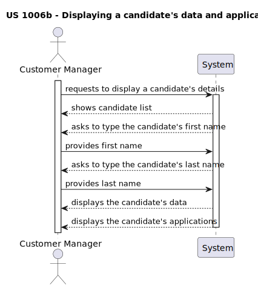
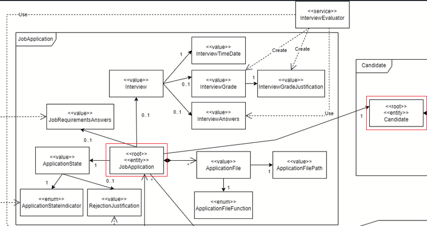
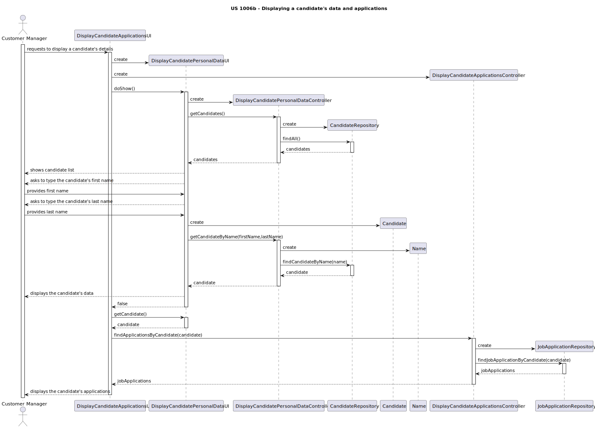

# US 1006b

### As Customer Manager, I want to display all the personal data of a candidate.

## 1. Context

* This US was assigned during the second **Sprint**.

## 2. Requirements

**Acceptance Criteria:**

[...]

Thus, this is what the team envisioned the US would act like:



**Dependencies/References:**

* "Just the candidate details."

## 3. Analysis

Some of the analysis of this user story has already been detailed in the documentation for [US1006](../us_1006/readme.md).

As such, in this section, there will be the additional details relevant to US1006b.

---

The picture bellow shows that the Candidate is known by their JobApplication, and as such, to be able to list the Candidate's applications, we only need to find the applications by candidate in their repository. 



## 4. Design

This user story's design follows the same principles and decisions made in [us1006](../us_1006/readme.md).



## 5. Implementation

* TODO

## 5.1. Tests

Seeing as this US is an extension of [US1006](../us_1006/readme.md), some of the necessary steps that need testing have already been covered in it and its respective [markdown file](../us_1006/readme.md). Here are some additional unit tests that ensure the other components of this User story are functional:

* The team also developed other unit tests to see if the other components used in this US are working as intended:

```
@Test
void ensureMustHaveJobOpening() {
assertThrows(IllegalStateException.class, () -> new JobApplicationBuilder().ofCandidate(CANDIDATE).build());
}

    private JobOpening getJobOpening(){
        CustomerCode customerCode = new CustomerCode("ABC123");
        Name name = Name.valueOf("ACME", "Corp");
        EmailAddress customerManagerEmail = EmailAddress.valueOf("manager@acme.com");
        Customer customer = new Customer(customerCode, name, customerManagerEmail);
        JobOpeningFunction jobOpeningFunction = JobOpeningFunction.valueOf("Software Engineer");
        JobOpeningMode jobOpeningMode = JobOpeningMode.ONSITE;
        JobOpeningAddress jobOpeningAddress = JobOpeningAddress.valueOf("123 Main St, Anytown, USA");
        Vacancies numberOfVacancies = Vacancies.valueOf(5);
        LocalDateTime activeSince = LocalDateTime.now();
        return new JobOpening(ContractType.FULL_TIME, jobOpeningFunction, jobOpeningMode, jobOpeningAddress, customer, numberOfVacancies, activeSince);
    }
```

```
    @Test
    void ensureCanCreateJobApplicationWithJobOpening() {
        JobOpening jobOpening = getJobOpening();
        // Act
        JobApplication jobApplication = new JobApplicationBuilder()
                .withState(APPLICATION_STATE)
                .withFiles(APPLICATION_FILES)
                .forJobOpening(jobOpening)
                .ofCandidate(CANDIDATE)
                .build();

        // Assert
        assertNotNull(jobApplication);
        assertEquals(jobOpening, jobApplication.getJobOpening());
        assertEquals(CANDIDATE, jobApplication.getCandidate());
        // Add more assertions as needed
    }
```

```
    @Test
    void ensureCanAddInterviewToJobApplication() {
        JobOpening jobOpening = getJobOpening();

        JobApplication jobApplication = new JobApplicationBuilder()
                .withState(APPLICATION_STATE)
                .withFiles(APPLICATION_FILES)
                .forJobOpening(jobOpening)
                .ofCandidate(CANDIDATE)
                .build();
        Interview interview = new Interview(/* provide necessary arguments for Interview */);

        // Act
        jobApplication.addInterview(interview);

        // Assert
        assertEquals(interview, jobApplication.getInterview());
    }
```

```
    @Test
    void ensureCanChangeApplicationState() {
        // Arrange
        JobOpening jobOpening = getJobOpening();
        JobApplication jobApplication = new JobApplicationBuilder()
                .withState(APPLICATION_STATE)
                .withFiles(APPLICATION_FILES)
                .forJobOpening(jobOpening)
                .ofCandidate(CANDIDATE)
                .build();
        ApplicationState newState = new ApplicationState();

        jobApplication.changeStateTo(newState);

        assertEquals(newState, jobApplication.getApplicationState());
    }
```

## 6. Integration/Demonstration

During the design process of this User Story, some decisions were made so that this functionality could be as user friendly as possible, while fulfilling its main purpose. However, it became abundantly clear that this us is dependant on us1006.

Firstly, since this us is an extension of the funcionalities of US1006, we determined that it would be redundant to repeat the code used previously to achieve the same exact goal. As such, we called the UI of US1006 (DisplayCandidatePersonalDataUI) and its respective controller (DisplayCandidatePersonalDataController) in order to execute each of their tasks in the correct order. The sequence of the this user story is to first show the personal data and then the applications of a candidate. Because of this, we being by calling the personal data UI, execute it and then continue where it left off. Unfortunately this could only work by creating an atribute in the DisplayCandidatePersonalDataUI class that stores the Candidate that was chosen, a dubious practice but also a decision we made in order to make this user story function as expected. Without this, we would need to ask the Customer manager to select a Candidate again, which is incovenient and confusing.

This design and integration decision allowed for the program to run smoothly, in the eyes of the user, and be able to display everything that was required in this user story.

## 7. Observations

Some exceptions had to be made for this User Story to run smoothly. For more details, check the Integration section.