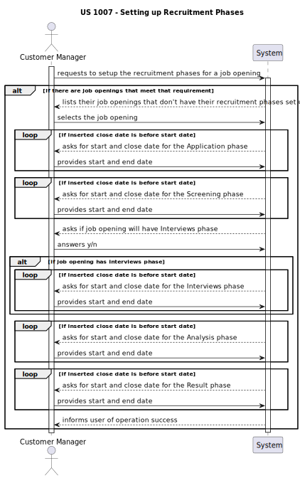
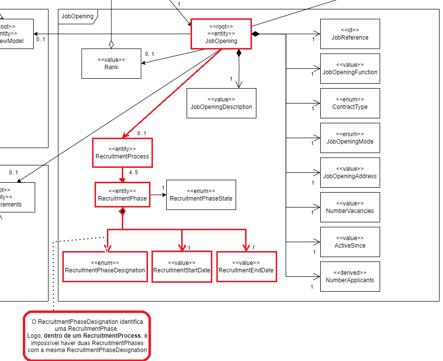
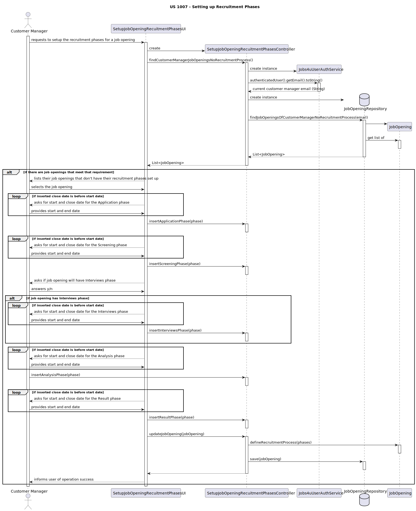
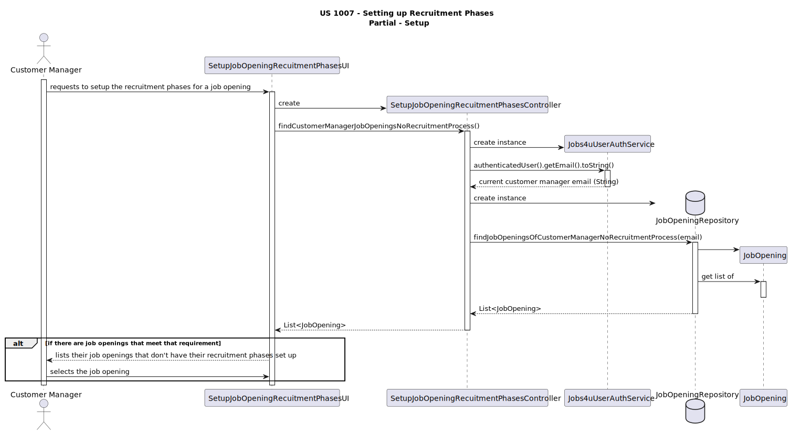
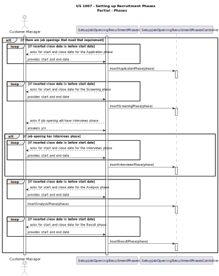
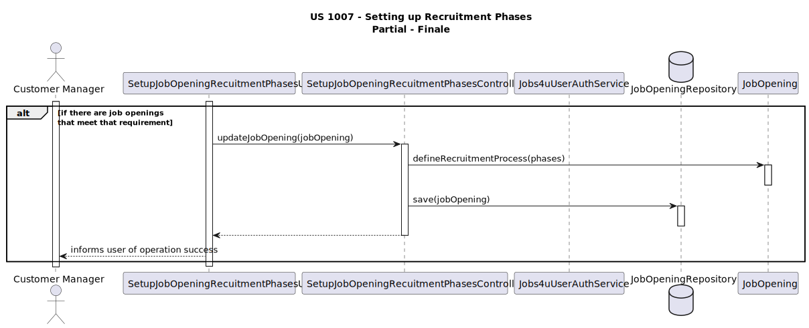

# US 1007

**As Customer Manager, I want to setup the phases of the process for a job opening.**

## 1. Context

* This US was assigned during the second **Sprint**, as part of the Job Opening setup.

## 2. Requirements

**Acceptance Criteria:**

* 1007.1. The team must ensure that the *Customer Manager* can define the *Recruitment Process* for a *Job Opening* that does not have one.
* 1007.2. The team must ensure that the *Recruitment Phases* are setup correctly.

Thus, this is what the team envisioned the US would act like:

This way, we can see the way the user interacts with the system along the functionality.

**Dependencies/References:**

* N/A

## 3. Analysis

* The team concluded that we needed to create a new **UI** (**SetupJobOpeningRecruitmentPhasesUI**) and a new **Controller** (**SetupJobOpeningRecruitmentPhasesController**).
* The program should also be able to access the **JobOpeningRepository** to get the objects and to update the chosen one.
* The sections in red show what is related to this *US*:
  

## 4. Design

* Thinking about how this *US* would be implemented, the team elaborated this **Sequence Diagram**:

* This way, we can see the way that the various components create and call themselves.

### Partial Diagram - Setup

### Partial Diagram - Phases

### Partial Diagram - Finale

## 5. Tests

* Tests were made to verify if the phases in the Recruitment Process are setup correctly. These tests include:
  * Ensuring the phases don't overlap;
  * Ensure that the phases are in correct order;
  * Ensure that the only phase that's optional is the *INTERVIEWS* phase.

## 6. Implementation

* In order to do this correctly, we needed to make sure that the database is altering an already existing *Job Opening*, defining a new attribute.

## 7. Integration/Demonstration

* This **UI** gets integrated into the rest of the project by the *Customer Manager's Menu*. 

## 8. Observations

* N/A