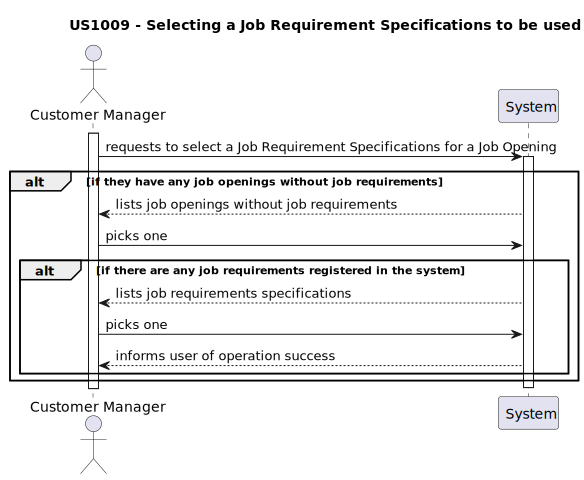
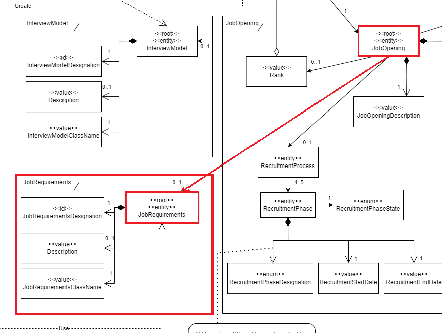
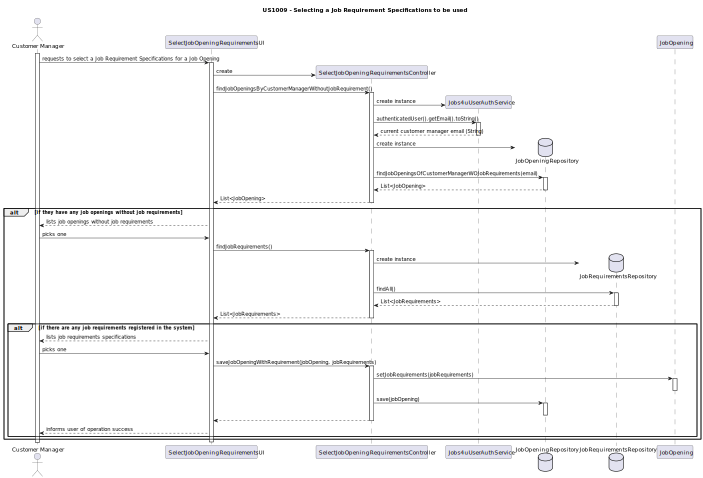

# US 1009: As Customer Manager, I want to select the requirements specification to be used for a job opening.

## 1. Context

* This US was assigned during the second **Sprint**, as part of the *Listing USs* and *Plugin* usage.

## 2. Requirements

**Acceptance Criteria:**

* 1009.1. The team must ensure that the *Job Openings* are listed correctly (in order to be chosen).
* 1009.2. The team must ensure that the *Requirement Specifications* are listed correctly.
* 1009.3. The team must ensure that the *Job Opening* is updated in the database after the *Requirement Specification* is chosen.

Thus, the team concluded that this is how this *US* acts:

**Dependencies/References:**

*  The support for this functionality must follow specific technical requirements, specified in LPROG.
    * The **ANTLR** tool should be used (**https://www.antlr.org/**).

## 3. Analysis

* The domain model includes everything that's needed in order to perform this *US* as needed.
* The sections in red show what is related to this *US*:
  

## 4. Design

* The team didn't make many decisions regarding this *US* since it's just selecting an item to fill a chosen *Job Opening*. Thus, there aren't many liberties to be taken.

Thus, the team concluded that this is how this *US* acts:

## 5. Tests

* Tests were made to be sure that the *Job Opening* is actually updated.

## 6. Implementation

* Nothing to say here

## 7. Integration/Demonstration

* This *US* is integrated into the rest of the project by the *Customer Manager's Menu*.

## 8. Observations

* N/A