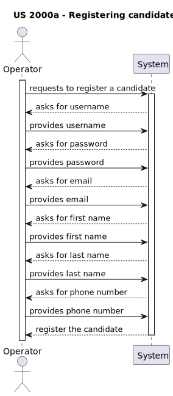
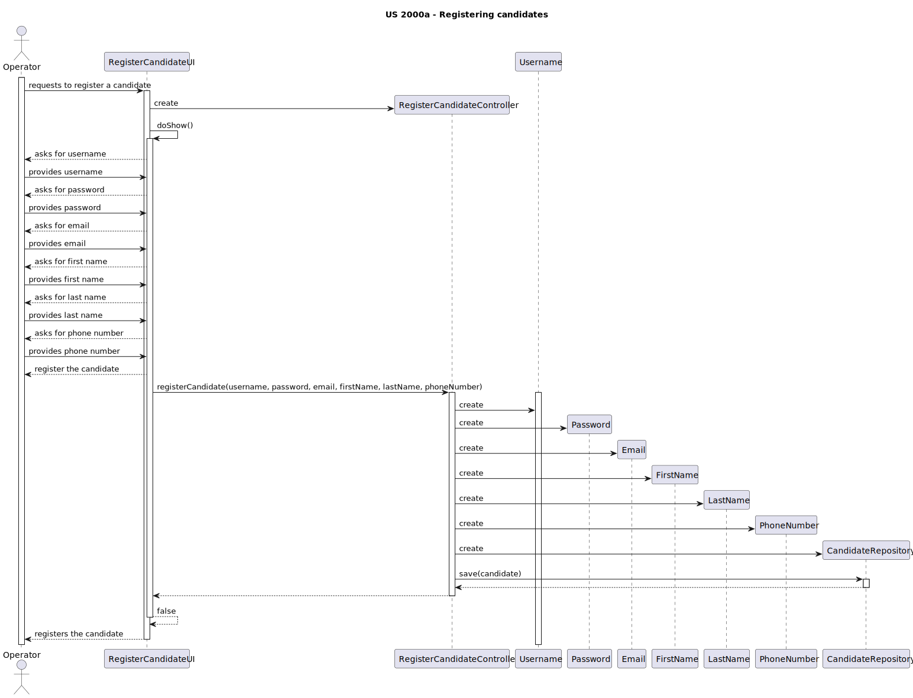

# US 2000a
**As Operator, I want to register a candidate and create a corresponding user**

## 1. Context

* This US was assigned during the second **Sprint**.

## 2. Requirements

**Acceptance Criteria:**

The Operator menu must contain the ability to register candidates in the way described in the user story, and they must all be functional.

Thus, this is what the team envisioned the US would act like:

**Dependencies/References:**

* NA

## 3. Analysis

The domain model does not include any of the necessary classes for the functionalities of this User Story, since it isn't part of the business concept/model. This also means there is no need to extend the domain model.

## 4. Design

* Thinking about how this *US* would be implemented, the team created a new **UI** (**RegisterCandidateUI**) and **Controller** (**RegisterCandidateController**) in accordance.
* This *US* also needs access to the **CandidateRepository** and **CandidateRepository**.

## 5 Tests

* Tests were made to verify if operator can register a candidate.

## 6. Implementation

* Nothing to say here.

## 7. Integration/Demonstration

* This **UI** gets integrated into the rest of the project by the *Operator's Menu*.

## 8. Observations

NA