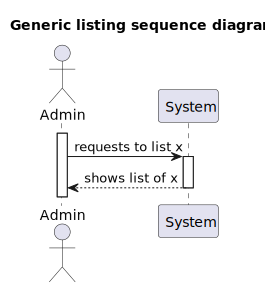
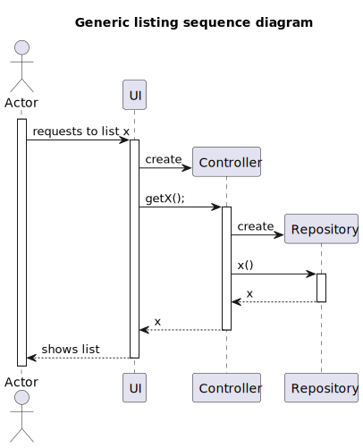

# US 2000b
### As Operator, I want to list all candidates

## 1. Context

* This US was assigned during the second **Sprint**.

## 2. Requirements

**Acceptance Criteria:**

The Operator menu must contain the ability to list the candidates.

Thus, this is what the team envisioned the US would act like:

This US follows the sequence represented by this generic listing diagram, in which x represents the candidates.

**Dependencies/References:**

* "Alternatively this can be achieved by a bootstrap process"

## 3. Analysis

The domain model does not include any of the necessary classes for the functionalities of this User Story, since it isn't part of the business concept/model. This also means there is no need to extend the domain model.

## 4. Design

This US follows the sequence represented by this generic listing diagram, in which:
* Actor represents the Operator;
* x represents the candidates;
* UI represents the ListCandidatesUI;
* getX() represents the findAllCandidates() method from the controller;
* Controller represents the ListCandidatesController;
* x() represents the Candidates() method from the repository;
* Repository represents the CandidatesRepository.

## 5. Tests

* Nothing to say here.

## 6. Implementation

* Nothing to say here.

## 7. Integration/Demonstration

* This **UI** gets integrated into the rest of the project by the *Operator's Menu*.

## 8. Observations

N/A