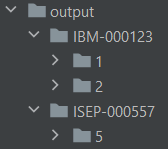
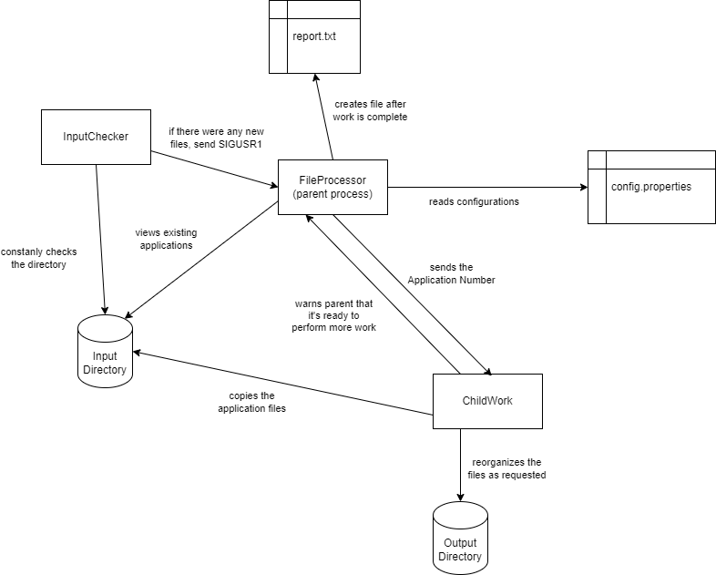

# US 2001

## 1. Context

* This US was assigned during the second **Sprint**. It's meant to act just like the **Application File Bot**.

## 2. Requirements

**US 2001** As Product Owner, I want the system to, continuously, process the files
produced by the Applications Email Bot, so that they can be imported into the system
by initiative of the Operator

**Acceptance Criteria:**

* 2001.1. The parent process should be able to configure aspects like:
  * Name of the input directory,
  * Name of the output directory,
  * Number of worker children,
  * Time interval for periodic checking of new files;
* 2001.2. The first child process should be able to detect if there are any **new** files inside the input directory, sending a signal to the parent process if there are.
* 2001.3. Each child worker should copy every file associated with one job application to the output directory. When it's done, it should inform the parent process that it's ready to perform more work.
* 2001.4. The output directories should be organized in the following fashion:

  
  * Note: This is just a mock-up of what the output format would look like, since, during the making of this documentation, the implementation for this US was not developed.
* 2001.5. The parent process should handle the **SIGINT** signal, terminating all children and waiting for their termination

* **Technical Constraint:** Since this US asks us to use *UNIX signals*, a **Windows OS** cannot possibly run this section.

**Dependencies/References:**

* The base solution for the upload of files must be implemented following specific technical requirements such as the use of the C programming language with processes, signals and pipes.

## 3. Analysis

* The team analyzed the project's various roles and created the module **jobs4u.applicationfilebot** in accordance.
  * Note: This module is not followed by the main [pom.xml](../../../../pom.xml), since this is developed in **C**, not in **Java**.
* The team, when given the option to provide the configurations (input and output directory, etc.), decided to provide them in a .properties config file. (Example: [config.properties](../../../../SCOMP/src/main/2001/FileProcessor/config.properties))

## 4. Design

* The team decided to separate this functionality into a main **.c** file (**FileProcessor.c**) that calls the following files:
  * **ConfigFileReader.c**, resposible for reading the previously mention **.properties** file, and delivering them in a struct named **ConfigSettings**. This is done during the beginning of the program's execution, since the configurations are used by the next component.
  * **InputChecker.c**, responsible for checking if the previously defined *input directory* has any **new** files. If it does, this component sends a signal to the main one (**FileProcessor.c**). This component is constantly being executed by a child process, created only to check the input directory until the program is stopped.
  * **ChildWork.c**, responsible for copying the files the files of **one** *Job Application* from the *input directory* to the *output directory* organized by the *Job Reference* and then by the *Application Number*. This program is ran by several child processes (individually), that receive the *Application Number* they're responsible for from the parent process. After they're done, they inform the parent process that they're ready to perform more work.

This is the way the various components are going to interact with one another:

**Note:** It's important to mention that the parent process is both **FileProcessor.c** and **ConfigFileReader.c**.

## 5. Implementation

* In order to facilitate the US's implementation, the team developed two *structs*:
  * **ConfigSettings**, responsible for holding the values defined in the **.properties** file. An instance of this struct is filled by **ConfigFileReader.c** and used by the other components.
  * **InfoApplication**, responsible for holding an *Application Number* and the path to where their files were copied.

### 5.1. Tests

* A test was formed in order to verify this Use Case's intention, this test can be built and ran in [this path](../../../../SCOMP/src/test/2001/scripts/FileProcessor).
  * **Note:** This test sometimes behaves weirdly with the content it prints. However, that is exclusive to the test, and it still shows that the *US* in itself runs as supposed.

* The team also developed other unit test in order to verify if the **config.properties** is being read correctly. This test can be built and ran in [this path](../../../../SCOMP/src/test/2001/scripts/ConfigFileReader).

## 6. Integration/Demonstration

* This *US* is not integrated into the rest of the system, since it's entirely written in **C**, not in **Java**.

## 7. Observations

* As mentioned in the **Requirements** section, this US cannot be used in a **Windows OS**, since it uses things that are only available in **Unix systems**.