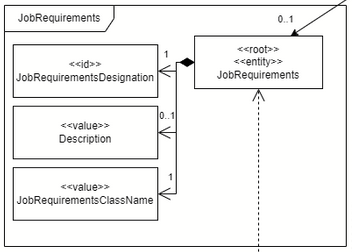

# US 2003

### As Operator, I want to generate and export a template text file to help collect data fields for candidates of a job opening (so the data is used to verify the requirements of the job opening).
## 1. Context

* This US was assigned during the second **Sprint**.

## 2. Requirements

**Acceptance Criteria:**

[...]

Thus, this is what the team envisioned the US would act like:

**Dependencies/References:**

* "Requirement Specifications and Interview Models The support
  for this functionality must follow specific technical requirements, specified in LPROG.
  The ANTLR tool should be used (https://www.antlr.org/)."

## 3. Analysis

This User Story's requirements are fulfilled by the design envisioned in the Domain Model. 

In the picture bellow, we can see the JobRequirements entity is connected to three values: 
* **JobRequirementsDesignation** - the name by which the plugin is known to the user; 
* **Description** - a description of what is the plugin;
* **JobRequirementsClassName** - name of the class that implements the interface ReqEvaluator.

The **JobRequirementsDesignation** serves the purpose of storing a name that can be used to identify the pluggin in a way that's comprehensible to the user. This is useful for this User Story as the operator will have to select a pluggin to use from the ones available in the program, and they are not expected to be familiar with the more technical aspects of how it works, only needing to deploy it. This is why having an indicative and recognizable name is crucial.

Similarly, the **Description** is helpful for providing additional information. If the title isn't evocative enough, checking the description can clear up the confusion and purpose of the pluggin.

Lastly, the **JobRequirementsClassName** is the link between the idea of the pluggin and the actual file and execution of it, being what is needed for the operator to generate and export the file. 

## 4. Design

* TODO

## 5. Implementation

* TODO

## 5.1. Tests

* TODO

## 6. Integration/Demonstration

* TODO

## 7. Observations

* TODO