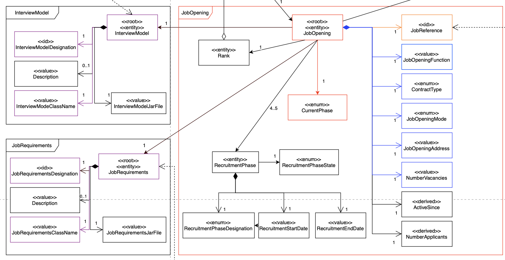

# US 1004
As Customer Manager, I want to edit a job Opening

## 1. Context
This US was assigned during the **third Sprint**.

## 2. Requirements

### 2.1. Acceptance Criteria


It has to be possible to edit or change all job Opening atributes, to be specific:

 - Number of Vacancies
 - Recruitment Process
 - Interview Model
 - Address
 - Function
 - Job Requirements
 - Contract type
 - Mode

**Note**: 'Active Since' and 'Customer attributes' will not be edited in order to maintain system consistency as specified by the client on the quesitons below.

### 2.2. Dependencies

* This *US* has a dependency on [**US 1002**](../../sprintB/us_1002/readme.md).

### 2.3. Pre-Conditions

* A *Job Opening* must be registered in the system (hence the dependency on **US 1002**).

### 2.4 Open Questions


* **Question 1:**  Nesta user story a edição de um JobOpening significa a edição de: **o Numero de vagas**, **Address**, **Contract Type**, **Mode**, **Description e Funcão?**. Estamos na linha de raciocício correta?**(Q144)**
  * **Answer:** Do meu ponto de vista deve ser possível alterar “tudo” exceto o próprio job reference. Deve-se ter em conta a manutenção do estado de consistência do sistema".
  

* **Question 2:** Não faz qualquer sentido a edição de active since **(Q193)**
  * **Question 2.1** É possivel editar o Customer associado a uma job Opening  uma vez que a criação da Job Reference se baseia neste?.
* **Answer:**  Estou de acordo com as suas preocupações. É isso a que me refiro quando escrevo “Deve-se ter em conta a manutenção do estado de consistência do sistema".


* **Question: 3** Em quais ou até que fases de recrutamento de um Job Opening em que pode-se editar as informações dela? **(Q154)**


* **Answer:** As alterações devem ser compatíveis com o “momento” em que estamos nessa job opening. Por exemplo, não faz sentido alterar o contract type se já estamos a receber candidaturas **(Application Phase)** uma vez que essas candidaturas foram feitas segundo uma descrição da oferta de emprego ,e por tal não faz sentido estar a alterar depois de as pessoas se candidatarem. 


* **Conclusion Q3:** Mas, por exemplo, deve ser possível alterar o job requirements specification (refere-se a outra US) enquanto as pessoas se candidatam, pois é um aspeto técnico, que não é do conhecimento público. Portanto, devem ter em conta este tipo de preocupações.


* **Question: 4**  Nesta user story é necessário registar a data e a hora da edição ( algo como **last_editDate**), cada vez que a editamos? **(Q156)**
  * **Answer:** Não me recordo da indicação de registar data e hora no momento de registar um job opening. Mas em geral, é comum haver um registo do utilizador que criou ou fez a última atualização de um “registo” no sistema. Outra boa prática é as aplicações terem sistemas de log para situações deste género. Mas não me recordo de haver algum requisito não funcional que mencione um sistema de log para este nosso projeto (exceto o do application file bot).


* **Question: 5** Não faz sentido editar nesta user story o Mode,morada e a função (Como "Front-end Programmer") na phase de Candidaturas, uma vez que são atributos que um candidato tem em mente quando faz uma candidatura a uma Job Opening. 
  * **Question 5.1:** Os Job Requirements não deveriam ser editáveis a partir da frase screening (assim como o Interview Model na fase Interviews)? Uma vez que esta é a fase em que estes são verificados? 
    * **Question 5.2:** O número de vagas é editável em todas as fases ? **(Q203)** 
* **Answer:** No geral o que refere está correto. As informações públicas de uma job opening **não devem ser alteradas depois de serem tornadas públicas**. Quanto a informações não públicas e mais técnicas penso que é aceitável que possam ser alteradas **se não resultarem em possíveis estados incoerentes do sistema.


* **Question 6:** É possível editar para cada um, a sua designação e descrição ?**(Q205)**
  * **Question 6.1** Faria ou teria algum interesse de que seja editado o nome da classe que implementa a interface que faz o serviço do para cada Plugin: "ReqEvaluator" para Job Requirements no meu caso. 
* **Answer:** A pergunta é um pouco técnica para mim. Para mim faz sentido a edição desde que mantendo a consistência do sistema. Quanto aos aspetos mais técnicos não sei responder.


* **Question 7:** Seria possível editar a sua fase atual da job Opening nesta user story?**(Q225)**
* **Answer:** Não - A intenção desta US é permitir a edição dos dados que caracterizam a job opening do ponto de vista de conceito de negócio. A alteração das fases tem uma US especifica.

**Note:** The number after each question (Q93 for example) marks the number of each question with the client :["Questions-to-Product-Owner"  ](https://myisepipp-my.sharepoint.com/:w:/g/personal/atb_isep_ipp_pt/EUuTReNeiM1NorupBbiS9hQB38kUh5TPLca7uDYEitSeZg?e=I5ymVX) file.
  document.

# Aditional Requirments
## Questions Conclusions

## Questions Conclusions

**1-** Non-Editable Attributes (inall phases):

- Job Reference  --> Q1
- Customer       --> Q2
- Active Since   --> Q2

**2 -** Editable Attributes before Application Phase:


- Contract Type   --> Q1
- Mode            --> Q1
- Address         --> Q1
- Function        --> Q1
- Number of Vacancies  --> Q1

**3-** - Editable Attributes starting on Application Phase

- Job Requirements --> Conclusion Q3
  - Job Requirements Designation --> Q5
- Interview Model --> Conclsusion Q3
  - Job Requirements Designation --> Q5

**4** Editable Attributes starting on after Application Phase.

- None --> Q4 And Q5


## 3. Analysis


## Importance Color Filtering
Some Concepts might be important. They are not guaranteed to be important,hence they depend on the face.For showing the importance we provided the image below with the following important rules/condicions
- **Red:** Important regardless of the current phase.
- **Orange:** Important for creating a job opening, not for the purpose related to the user story.
- **Blue:** Important if the job opening does not have a current phase set.
- **Purple:** Important if the job opening does not have a current phase set or if the current phase is "Application".
- **Black:** Not relevant.



**Note 1:** The Aggregate color bolding indicates changes on the entity (repository on the system) as Job Opening is for example.

**Note 2:** The InterviewModel **Designation** and the JobRequirements **Designation** are highlighted in red to emphasize their relevance in the user story display. 

**Note 3:**: 'Active Since' and 'Customer attributes' will not be edited in order to maintain system consistency as specified by the client on the quesitons **Q156**.

## 4. Design

 See [**Design**](../../sprintC/us_1004/design.md) on Files.

- Ask customer to Select **an existing Job Opening**:
 
- Get the Phase
- Filter/Get  editable-atributes by Phase

- **4.1 Before Application:**
  - Address attributes specified above that need to be set or edited before the application phase begins.
    - **4.2 On Application Phase:**
        - *Job Requirement.:* 
        - *Interview Model.*
    - **4.3 After Application Phase:**
        - Dont edit any atributes and inform the user up from this phase no atributes are editable


- Editable atributes Menu is displayed to Customer, and he chooses to select a atribute.
- Customer inserts/chooses dependent on the atribute value. (Ex JobOpening Mode is a selection atributeonsyte,Remote or Hybrid) , contrasting most which is a String input.
-  Last two bullets are repeated for each wanted atribute or for even an edited atributes before.

- **Register Changes on Job Opening (Information Expert):**
- 
**Note:** See [**Design**](../../sprintC/us_1004/design.md) on Files for more proper Details.


**Note2:** Only one phase is selected, thus, this user story will execute only one of the steps **3.1**, **3.2**, or **3.3**, never all or a combination of any of them.

## 5. Test

## 5.1. Unit Tests

* Verify only  Specified atributes are editable before Application Phase:
```java 
@Test
  void ensureAtrribuesAreEditedBeforeApplicationPhase() {
  JobOpening jobOpening = new JobOpening(CONTRACT_TYPE, JOB_OPENING_FUNCTION, JOB_OPENING_MODE, JOB_OPENING_ADDRESS, CUSTOMER, VACANCIES, ACTIVE_SINCE, 1L);
  assertDoesNotThrow(jobOpening::isOnCorrectPhases);
  }
```

* Verify only Specified atributes are editable on the Application Phase:
```java 
  @Test
  void ensureAtribuesAreEditeOnApplicationPhase(){}{
  JobOpening jobOpening = new JobOpening(CONTRACT_TYPE, JOB_OPENING_FUNCTION, JOB_OPENING_MODE, JOB_OPENING_ADDRESS, CUSTOMER, VACANCIES, ACTIVE_SINCE, 1L);
  RecruitmentProcess process = new RecruitmentProcess(Arrays.asList(
  new RecruitmentPhase(RecruitmentPhaseDesignation.SCREENING, LocalDate.of(2024, 4,6), LocalDate.of(2024,4,7)),
  new RecruitmentPhase(RecruitmentPhaseDesignation.ANALYSIS, LocalDate.of(2024, 4,8), LocalDate.of(2024,4,9)),
  new RecruitmentPhase(RecruitmentPhaseDesignation.RESULT, LocalDate.of(2024, 4,10), LocalDate.of(2024,4,11))));

        process.setCurrentPhase(new RecruitmentPhase(RecruitmentPhaseDesignation.APPLICATION));
        jobOpening.setRecruitmentProcess(process); //Currently in Application phase
        assertDoesNotThrow(jobOpening::isOnCorrectPhases);

  }

 ```
* Verify only Interview Model and JobRequirements are edited on Screening Phase:

```java 
@Test
void ensureAtribuesAreEditeOnScreeningPhase(){}{
JobOpening jobOpening = new JobOpening(CONTRACT_TYPE, JOB_OPENING_FUNCTION, JOB_OPENING_MODE, JOB_OPENING_ADDRESS, CUSTOMER, VACANCIES, ACTIVE_SINCE, 1L);

        RecruitmentProcess process = new RecruitmentProcess(Arrays.asList(
                    new RecruitmentPhase(RecruitmentPhaseDesignation.SCREENING, LocalDate.of(2024, 4,6), LocalDate.of(2024,4,7)),
                    new RecruitmentPhase(RecruitmentPhaseDesignation.ANALYSIS, LocalDate.of(2024, 4,8), LocalDate.of(2024,4,9)),
                    new RecruitmentPhase(RecruitmentPhaseDesignation.RESULT, LocalDate.of(2024, 4,10), LocalDate.of(2024,4,11))));

        process.setCurrentPhase(new RecruitmentPhase(RecruitmentPhaseDesignation.SCREENING));
        jobOpening.setRecruitmentProcess(process); //Currently in Screening  Phase
        assertThrows(RuntimeException.class, jobOpening::isOnCorrectPhases);
}
```


## 6. Integration
This US is integrated into the Customer Manager Menu.


## 7. Observations

* TODO

