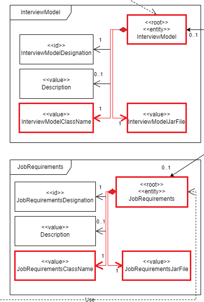
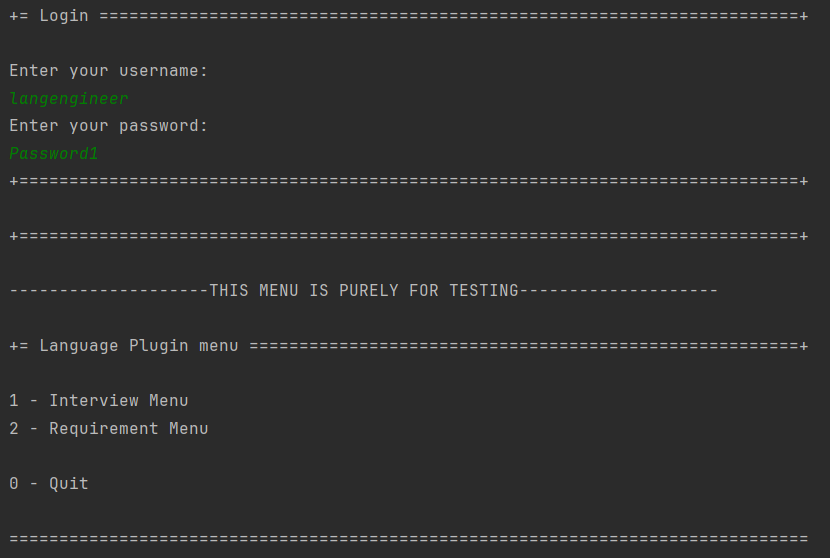
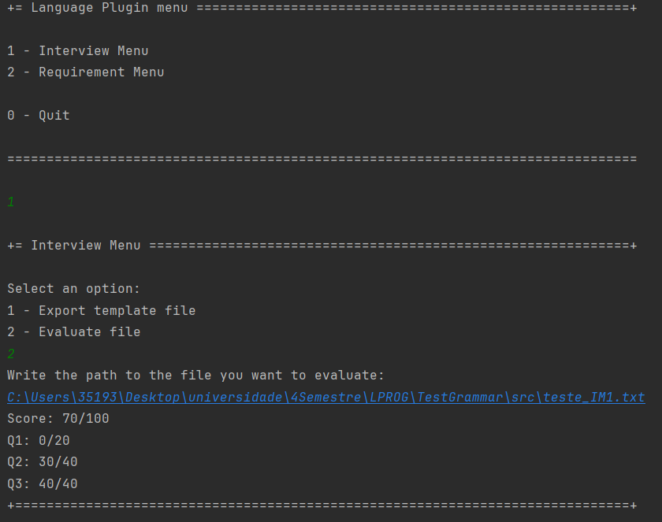

# US 1008

**As Language Engineer, I want to deploy and configure a plugin (i.e., Job Requirement Specification or Interview Model) to be used by the system.**

## 1. Context

* This US was assigned during the second **Sprint**, as part of the *Plugin* setup.

## 2. Requirements

**Acceptance Criteria:**

* 1008.1. The team must ensure that the our program can read an outside jar file (plugin) that implements an *Interface* from our program, without knowing the specific implementation.

The team decided that, since most of this *US* happens outside our program, a **System Sequence Diagram** was not appropriate.

**Dependencies/References:**

*  The support for this functionality must follow specific technical requirements, specified in LPROG. 
   * The **ANTLR** tool should be used (**https://www.antlr.org/**).

## 3. Analysis

* The team concluded that the domain model had what was required for this *US*.

## 4. Design

* The team decided to create a new **Module** [**jobs4u.app.language.grammars**](../../../../jobs4u.app.language.grammars) that will be used by a **Language Engineer** to test their new grammars.

## 5. Tests

* Not applicable here

## 6. Implementation

* The user will have [a menu](../../../../jobs4u.app.language.grammars/src/main/java/jobs4u/app/language/grammar/LanguageApp.java) where they must login as a **Language Engineer**. Then, they can test the [interview grammars](../../../../jobs4u.app.language.grammars/src/main/antlr/interview) or the [requirements grammar](../../../../jobs4u.app.language.grammars/src/main/antlr/requirements) that they created, both on different menus ([**InterviewPluginUI.java**](../../../../jobs4u.app.language.grammars/src/main/java/jobs4u/app/language/grammar/presentation/languagePlugin/menu/interview/InterviewPluginUI.java) and [**RequirementPluginUI.java**](../../../../jobs4u.app.language.grammars/src/main/java/jobs4u/app/language/grammar/presentation/languagePlugin/menu/requirements/RequirementPluginUI.java) respectively).

## 7. Integration

* This **US** is not integrated onto the rest of the **Language Engineer Use Cases**.

## 8. Demonstration

This is how the program looks when doing the *Login*:

**Note:** As it is visible, the program mentions to the user that this **Module** is to be used only for testing.

Then, the user will choose a menu and an option, this is an example:

## 9. Observations

* As said previously, this *US* is completely different from the rest, as it is not one to be used like the other *Use Cases*, but purely for the **Language Engineer** to test the grammars that they coded in that same **Module**.