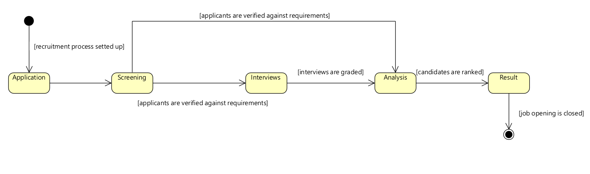

### US 1010 : As Customer Manager, I want to open or close phases of the process for a job opening.

**Issue number: #32**

### 1. Analysis

- Main operation of this us is a **WRITE** operation.
- The start and end dates are merly sugestive.
- Each phase has at least 3 states: open, active, closed (see Q171).

#### 1.1 Domain model changes

- To the JobOpeningPhase class added a state attribute.
- To the JobOpening class added isClosed attribute.

#### 1.2 Domain invariants

- When a phase closes, the next one opens (independently of the phases, see Q16).
- The phases defined in the recruitment process must be respected sequentialy, it should not be possible to skip
  phases (see Q143).
- Before closing a phase the conditions to close that phase must be met (see Q201, see state diagram bellow).
- We can only retrocede a phase if the current one is in the state open (see Q212).
- When the result phase is closed the job opening is no longer active.
- To open an interview phase the interview model must be defined (see Q161).

#### 1.3 State diagram for application phases

#### 1.4 Dependencies

- US 1001 : As Customer Manager I want to register a customer and that the system automatically creates a user for that
  customer.
  Because to register a job opening you need a customer.
- US 1002 : As Customer Manager, I want to register a job opening.
  Because in order to open or close phases, the job opening must already be registered.
- US 1007 : As Customer Manager, I want to setup the phases of the process for a job opening. Because in order to open
  or close phases, the job opening must already have an associated recruitment process.

### 2. Design

- The setters in the RecruitmentProcess are set as public although they are not intended to be called be everyone. The
  reason was that the service is located in a different package and java doesn't allow only the service to access those
  methods.

#### 2.1 Responsability distribution

- Class **RecruitmentProcessManager** : Domain service class responsible for validating the conditions of each phase.
- Class **RecruitmentProcess**: Responsible for ensuring sequential order of the phases.
- Class **RecruitmentProcessManager**: Responsible for verifying if it's possible to retrocede a phase, in other words,
  if the active phase is only in the open state and not in the active state.

#### 2.2 Sequence Diagram

### 3. Tests planing

Unit tests:

- Ensure that when a phase is closed the next one is opened automatically.
- Ensure we cannot retrocede phase when te current phase is in the active state.
- Ensure we can only close a phase if the requirements are met. This is specific for each phase.
- Ensure when the result phase is closed the job opening is also closed.

Functional tests:

- Verify in the JobOpening aggregate that indeed the phases are updated in the database.

### 4. Tests Implementation

