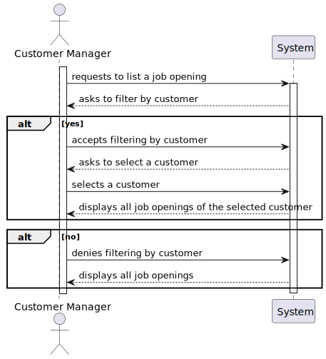

# US 1013
### As Customer Manager, I want to rank the candidates for a job opening.

## 1. Context

* This US was assigned during the third **Sprint**.

## 2. Requirements

### 2.1. Dependencies

This US is dependent on [US2002](../../sprintB/us_2002/us2002.md) and [US1003](../../sprintB/us_1003/readme.md).

### 2.2. Pre-Conditions

There must me job openings and applications(and the candidates that submitted them) registered in the system for this user story to work as intended.

### 2.3 Open Questions

```
Q17 Beatriz - Relative to section 2.2.1, it is in the Analysis phase that the interviews are evaluated and that result is what defines the ranking od the candidates, right? Futhermore, what is the CV for in this phase? Seeing as the interviews aren't mandatory, what happens when they are not realized?

A17 The points assigned to an interview are calculated in the interview phase. The Cv and other data (such as the result of the interviews) is used by the Customer Manager in the analysis phase to rank the candidates. But the ranking is the responsibility of the Customer Manager (for example, it doesn't have to follow the grading system for the interviews). US 1013 corresponds with the manual ranking made by the Customer Manager. The fact that there are no interviews does not imply anything for the ranking of the candidates because it does not explicity depend on them. 
```

````
Q142 Varela – US1013 - Candidate Ranking – Mr Client mention a manual ranking (Q17). If the pontuation of an interview is not essential for the candidate's rank, what criteria is to be used when ranking?

A142 Please view again Q17. The ranking is a decision of the Customer Manager based on all the data that he/she may have during the process (including CV and other attached documents and the interviews as well as other data/information that may not be part of the system). 
````

```
Q148 Pedro - US 1013 - My question is relative to how the ranking is made. Does the customer manager assign a grade to each application and the system sort it in ascending order, ranking each application? If so, will the grade have a scale? Even if so, can they only assign a grade when he already knows all of them? Or could they assign it and the ranking is only placed when all other applications have been evaluated?

A148 See Q17. The sorting of the candidates (ranking) is the responsibility of the customer manager. They can base the result in the interviews and other information, but the ranking isn't automatic. There is no grade or scale. The applications are sorted.
```

```
Q155 Varela – US1013 - Rank Entries - Is there a limit on rank entries? Let's say that 100 candidates apply for a job opening. Does the Customer Manager have to sort all 100 candidates?

A155 The order of candidates should include at least all the first candidates within the vacancy number and some following candidates. At the moment, I do not know exactly the number of the following candidates to be ordered. Therefore, I would like for it to be a global configuration property in the system. It could be a number representing a magnitude from the vacancy number. For instance, 1 could mean exactly the same number of vacancies, 2 the double, 0,5 half the number of vacancies. The remainder of the candidates could be just tagged as not ranked.
```

```
Q163 Miguel – US1013 - When the customer manager is ranking the candidates, in terms of UI, should we display information from the application such as interview score, etc... or just the candidate's name and email?

A163 As stated before, I do not have specific requirements for the UI/UX. Use best practices. However, I would like it to be possible for the Customer Manager to have 2 or more instances of the application running, so that he/she could, for instance, see the interviews grades and, at the same time, register the order/ranking of the candidates. 
```

```
Q183 Costa – US1013 – documents - When ranking the candidates, the customer manager makes decisions based on their CV and other relevant documents. My question is: should there be an option for the customer manager to view the relevant documents before ranking a candidate? Or has the customer manager already made the decision before ranking the candidates and purely uses this functionality to assign the previously planned ranking?

A183. Once again this could be only a UX/UI issue. Please refer to Q17, Q163 and Q140. Also note that there is US1021 for listing application data. 
```

## 3. Analysis

### 3.1. Acceptance Criteria

**Acceptance Criteria:**

The customer manager must be able to assign a rank to each application.

Thus, this is what the team envisioned the US would act like:


This is how the program shows the job openings for selection:



### 3.2 Analysis

From reading the system description, we can conclude that:
* This *Use Case* belongs to the ***Analysis*** phase of the *Recruitment Process* of that *Job Opening* (See **Page 13**):
    * "**Analysis** - During this phase, the applications are analyzed (using all available information like interviews and curriculum) and **candidates are ranked**."

From the feedback given by the *Product Owner*, we can conclude that:
* This process is manual - the customer manager manually ranks the candidates. (See **Question 17**);
* The applications are sorted, not graded. The ranking is simply the order of the candidates, manually chosen by the customer manager (See **Question 148**); 
* This process is done for some of the *Applications* of that *Job Opening* depending on the number of vacancies available. (See **Question 155**)


This User Story's requirements weren't correctly fulfilled by the design envisioned in the Domain Model. Thus, there was need for it to be changed.

In the picture below, there are some classes that should be highlighted:
Rank's relation with JobOpening and JobApplication is key to this functionality, as a Rank is attributed to each JobApplication, which is known by the JobOpening it belongs to, as all applications (and candidates) will be ranked within the confines of the job opening that the customer manager wants to rank the candidates for.
The JobApplication also knows the Candidate that submitted it.


Futhermore, according to A155 (*See the Open Questions section in the Requirements*), there should be a global property for how many rankings will be chosen, in proportion with how many vacancies there are. As such, in the UI, there should be a constant named MULTIPLIER, an arbitrary number to multiply the number of vacancies for. This number serves the purpose of crontolling how many candidates get ranked. What it does is determine how many candidates will be ranked compared to the number of vacancies available. This is a decision that makes sense from the perspective of the customer manager who would have to endlessly rank candidates if too many people applied. Since only a select few will be chosen, it makes sense for there to be a proportional ammount of candidates ranked for that position.


## 4. Design

As observed during the analysis of this User story, the candidates will be sorted, which implies the existence of a sorted list of candidates. 

However, when uploading a list to the database, there is no garantee it will be saved in the correct order. As such, we decided that the Rank class would have to be changed and store both the position in the ranking and the id of the application that occupies that position, its instances saved in a list of Rank objects in the JobOpening class.


## 5. Tests

### 5.1. Tests

* Verify that the rank list is saved in JobOpening.
```java
    @Test void ensureRankListGetsSavedInJobOpening(){
        JobOpening jobOpening = new JobOpening(CONTRACT_TYPE, JOB_OPENING_FUNCTION, JOB_OPENING_MODE, JOB_OPENING_ADDRESS, CUSTOMER, VACANCIES, ACTIVE_SINCE);
        int id1 = 0, id2 = 1, id3 = 2;
        List<Integer> rankList = new ArrayList<>();
        rankList.add(id1);
        rankList.add(id2);
        rankList.add(id3);
        jobOpening.setRankList(rankList);

        assertEquals(rankList, jobOpening.getRankList());
    }
```

## 6. Implementation

Here are some key snippets of code:

* This is how the selection of a Job Opening is verified:
```java 
    boolean verificationSuccessful = false;
    do{
        try{
            jobOpeningReference = scanner.next();
            controller.jobOpeningExists(jobOpeningReference);
            controller.jobOpeningIsOfTheCustomerManager(jobOpeningList, jobOpeningReference);
            controller.jobOpeningIsNotRanked(jobOpeningReference);
            verificationSuccessful = true;
            jobOpening = controller.findJobOpening(jobOpeningReference);
        }catch(Exception e){
            System.out.println(e.getMessage());
            System.out.println("\nPlease try again.\n");
        }
    } while (!verificationSuccessful);
```

Let's take a look at each of the functions called by UI from the controller, with the purpose of verifying if the chosen job opening is valid, to understand how they work:

* **jobOpeningExists**
```java 
    public void jobOpeningExists(String reference) {
        boolean exists = false;
        for (int i = 0; i < jobOpeningRepository.findAll().size(); i++) {
            if (jobOpeningRepository.findAll().get(i).getJobReference() == JobReference.valueOf(reference)){
                exists = true;
                break;
            }
        }
        if (!exists){
            throw new IllegalArgumentException("\nThe selected Job Opening does not exist, try again.");
        }
    }
```

* **jobOpeningIsOfTheCustomerManager**
```java 
    public void jobOpeningIsOfTheCustomerManager(List<JobOpening> jobOpeningList, String jobOpening){
        boolean valid = false;
        for (int i = 0; i < jobOpeningList.size(); i++) {
            if (jobOpeningList.get(i).getJobReference() == JobReference.valueOf(jobOpening)){
               valid = true;
               break;
            }
        }
        if (!valid){
            throw new IllegalArgumentException("\nThe selected Job Opening is not associated with you, try again.");
        }
    }
```

* **jobOpeningIsNotRanked**
```java 
    public void jobOpeningIsNotRanked(String jobOpeningReference) {
        JobOpening jobOpening = jobOpeningRepository.findByJobReference(JobReference.valueOf(jobOpeningReference));
        List<Integer> rankList = jobOpening.getRankList();
        if (!rankList.isEmpty()){
            throw new IllegalArgumentException("\nThis job opening has already been ranked.");
        }
    }
```

* This is how the number of ranked candidates is calculcated:
```java 
    int vacancies;
    JobOpening jobOpening = application.getJobOpening();
    vacancies = jobOpening.getNumberOfVacancies().getNumberOfVacancies();
    return (int) (vacancies*MULTIPLIER);
```

* This is how the selection of a position in the ranking for a candidate is verified:
```java 
    for (int i = 0; i < numberOfRankings(jobApplicationList) && i < jobApplicationList.size(); i++) {
        System.out.printf("Please select a candidate:%n");
        boolean verificationSuccessful = false;
        do{
            try{
                option = scanner.nextInt();
                controller.insertedNumberisAValidOption(jobApplicationList.size(), option);
                controller.candidateIsNotRanked(usedOptions, option);
                verificationSuccessful = true;
                usedOptions.add(option);
                controller.rankApplication(jobOpening, jobApplicationList.get(i));
            }catch(Exception e){
                System.out.println(e.getMessage());
                System.out.println("\nPlease try again.\n");
            }
        } while (!verificationSuccessful);
    }
```

Let's take a look at each of the functions called by UI from the controller, with the purpose of verifying if the chosen job opening is valid, to understand how they work:

* **insertedNumberisAValidOption**
```java 
    public void insertedNumberisAValidOption(int size, int position) {
        if (position >= size){
            throw new IllegalArgumentException("\nOption unavailbale.");
        }
        if (position < 0){
            throw new IllegalArgumentException("\nThere are no positions lower than zero. Select a number greater than or equal to 0.");
        }
    }
```

* **candidateIsNotRanked**
```java 
    public void candidateIsNotRanked(List<Integer> positions, int position) {
        if (!positions.isEmpty()){
            for (int i = 0; i < positions.size(); i++) {
                if (positions.get(i) == position){
                    throw new IllegalArgumentException("\nThis position is already occupied.");
                }
            }
        }
    }
```

## 7. Integration

As explained before, this *US* has a dependency on the **List Job Openings** *US*, since the customer manager needs to select a job opening to rank the candidates for. 
It is also dependent on the **Registering Applications US** as there is a need for applications to exist in order to be able to rank them.
Of course, this *US* also inherits the dependencies of US's it is dependent on, such as the **Registering Job Openings US**.

This *US* is part of the **Customer Manager's** *UI*.

## 8. Demonstration

//TODO
