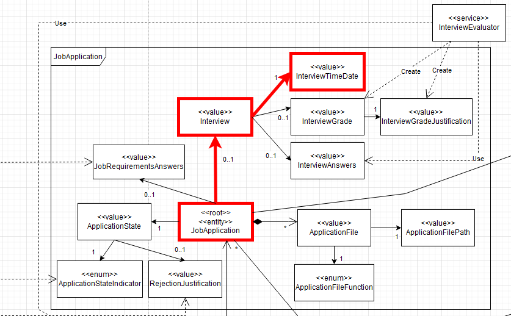
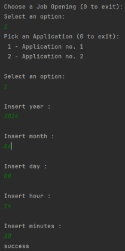
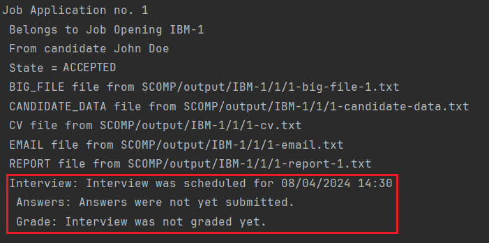

# US 1014

As **Customer Manager**, I want to record the time and date for an interview with a candidate.

## 1. Context

This US was assigned during the third **Sprint**, as part of the *Customer Manager*'s use cases.

## 2. Requirements

### 2.1. Dependencies

* This *US* has a dependency on [**US 1002**](../../sprintB/us_1007/readme.md)

### 2.2. Pre-Conditions

* An *Job Opening* must have *Interview* phase (hence the dependency on **US 1002**).
* An *Application* must not be rejected

### 2.3. Open Questions

* **Question 1:** US1014, time and date, quer dizer data de inicio e não data final? Podem haver entrevistas em paralelo?
  * **Answer 1:** "A US1014 refere-se à marcação da data de uma entrevista com um candidato. Algo como indicar o dia e a hora (ex: 23 de abril pelas 14:00). Em relação à marcação de entrevistas “sobrepostas” (com a mesma data de inicio), neste momento, seria algo a permitir (pode, por exemplo, o customer manager delegar noutra pessoa a condução da entrevista). Isso não invalida que devam validar se as entrevistas ocorrem dentro da fase das entrevistas.


* **Question 2:** Em relação à marcação da intervista, só deve ser possível marcar esta data quando? Só será possível marcar a entrevista quando a fase de recrutamento se encontrar na fase de intervista? Ou será possivel marcar noutras fases anteriores?
  * **Answer 2:** Por mim pode ser possível marcar as entrevistas antes mas deve-se ter em atenção se o candidato “passou” o screening. Não faz sentido marcar uma entrevista para um candidato que não foi aceite. Tenham em atenção este tipo de aspetos.


* **Question 3:** In the us "US 1014 - As Customer Manager, I want to record the time and date for an interview with a candidate." Is it possible to schedule interviews for any day and time or we must take into account weekends, working hours and holidays, for example?
  * **Answer 3:** The system should display the day of the week for the selected date. But the system should accept any valid date.


* **Question 4:**  Em relação à marcação de uma entrevista com um candidato, deve ser possível marcar mais do que uma entrevista por candidatura?
  *  **Answer 4:** O sistema nesta fase está pensado para apenas suportar uma entrevista por job application por isso não faz muito sentido marcar mais do que uma entrevista para um candidato a não ser para remarcar a mesma entrevista (por exemplo, o candidato faltou justificadamente a uma entrevista anterior). Neste contexto, eu diria que faz mais sentido poder alterar a marcação de uma entrevista do que marcar mais do que uma entrevista para o mesmo candidato


## 3. Analysis

**From the feedback given by the *Product Owner*, we can conclude that:**
* It involves scheduling a precise date and time for a candidate interview, rather than a range with a start and end time. It is acceptable to schedule overlapping interviews on the same date, provided they can be delegated to someone else. All interviews must occur within the designated interview timeframe (See **Question 1**);
* Interviews can be scheduled in advance, but make sure the candidate has passed the screening first. There's no point in scheduling interviews for unaccepted candidates. Keep these details in mind. (See **Question 2**);
* The system should show the day of the week for any chosen date, as long as the date is valid. (See **Question 3**);
* The system is designed to support just one interview per job application at a time. Therefore, scheduling multiple interviews for the same candidate isn’t necessary, unless it’s to reschedule an interview. In this situation, it's more practical to modify the existing interview appointment rather than scheduling a new one. (See **Question 4**)

* The domain model includes everything that's needed in order to perform this *US* as needed.
* The sections in red show what is related to this *US*:

  

### 3.1. Acceptance Criteria

* The program should list the *Job Openings* for the current user and the *Job Applications* from the choosen Job Opening that passed screening phase.
* The *Date* should should be in range of the *Interview* phase timeframe.

## 4. Design
* **USABILITY:** *JobOpeningRepository* and *JobApplicationRepository* classes need to be updated to be able to get a list with all *Job Openings* for the current *Customer Manager* and a list with all the *Job Applications* that passed the screening phase.
* We need to update the class *JobApplication* with a method that allows it to record the *Time* and *Date* of the *Interview*
* We also need to update the *JobOpening* with a method that checks if the *Date* is in range of the *Interview phase* timeframe.
* Another update in the *JobApplication* class needed is a method to add the *Interview* object to the *Job Application*.

## 5. Tests

### 5.1. Unit Tests

* Verify that all the *Date* is in the range of the *Inteview phase* timeframe;

```java 
@Test
void testVerifyIfIsInIterviewPhaseTimeframeWithinRange() {
    JobOpening jobOpening = new JobOpening();
    LocalDate startDate = LocalDate.of(2024, 4, 4);
    LocalDate closeDate = LocalDate.of(2024, 4, 10);
    LocalDate localDate = LocalDate.of(2024, 4, 6);
    assertDoesNotThrow(() -> jobOpening.verifyIfIsInIterviewPhaseTimeframe(localDate, startDate, closeDate));
}

@Test
void testVerifyIfIsInIterviewPhaseTimeframeBeforeRange() {
    JobOpening jobOpening = new JobOpening();
    LocalDate startDate = LocalDate.of(2024, 4, 4);
    LocalDate closeDate = LocalDate.of(2024, 4, 10);
    LocalDate localDate = LocalDate.of(2024, 4, 2);
    assertThrows(DateTimeException.class, () -> jobOpening.verifyIfIsInIterviewPhaseTimeframe(localDate, startDate, closeDate));
}

@Test
void testVerifyIfIsInIterviewPhaseTimeframeAfterRange() {
    JobOpening jobOpening = new JobOpening();
    LocalDate startDate = LocalDate.of(2024, 4, 4);
    LocalDate closeDate = LocalDate.of(2024, 4, 10);
    LocalDate localDate = LocalDate.of(2024, 4, 12);
    assertThrows(DateTimeException.class, () -> jobOpening.verifyIfIsInIterviewPhaseTimeframe(localDate, startDate, closeDate));
}
```

## 6 Implementation

We need to update the *JobApplication* class with a method that allows it to record the *Time* and *Date* of the *Interview*.

For Example:
```java
public void addInterviewInTimeframe(LocalDateTime localDateTime, LocalDate localDate, LocalDate starDate, LocalDate closeDate){
    jobOpening.verifyIfIsInIterviewPhaseTimeframe(localDate, starDate, closeDate);
    interview = new Interview(localDateTime);
    addInterview(interview);
}
```

We also need to update the *JobOpening* with a method that checks if the *Date* is in range of the *Interview phase* timeframe.

For Example:
```java
public void verifyIfIsInIterviewPhaseTimeframe(LocalDate localDate, LocalDate startDate, LocalDate closeDate) {
    if (localDate.isBefore(startDate) || localDate.isAfter(closeDate)) {
        throw new DateTimeException("The date " + localDate + " is outside the allowed range: "
                + startDate + " to " + closeDate);
    }
}
```

## 7 Integration

As explained before, this *US* has a dependency on the **Register an Application** *US*, since it needs an *Application* on the system in order to list all of its details.

This *US* is part of the **Customer Manager's** *UI*.

## 8. Demonstration

Choose year, month and day for the interview, and the system will check if the date is within the interview phase timeframe. If it is, the interview will be scheduled. If not, the system will throw an exception.



Showing the interview scheduled:




