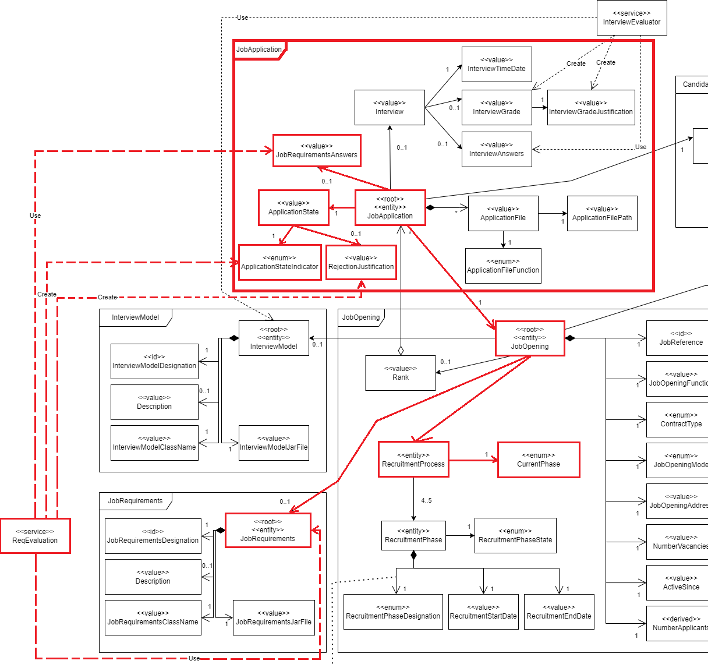

# US 1015

As **Customer Manager**, I want to execute the process of verification of requirements of applications for a job opening.

## 1. Context

This US was assigned during the third **Sprint**, as part of the *Customer Manager*'s use cases using ***plugins***.

## 2. Requirements
### 2.1. Dependencies

*  **NFR09(LPROG) - Requirement Specifications** and Interview Models The support
   for this functionality must follow specific technical requirements, specified in *LPROG*.
   The *ANTLR* tool should be used (https://www.antlr.org/).
* This *US* has a dependency on [**US 1009**](../../sprintB/us_1009/readme.md).
* This *US* has a dependency on [**US 2004**](../us_2004/readme.md)

### 2.2. Pre-Conditions

* The chosen *Job Opening* must have *Requirements* in order for their *Applications* to be analyzed (hence the dependency on **US 1009**).
* That *Job Opening*'s *Applications* should have their answers to the requirements submitted (hence the dependency on **US 2004**).

### 2.3 Open Questions

* **Question 1:** US1015 – Deve ser executado o processo para todos os candidatos ou apenas para alguns (segundo algum critério)?
    * **Answer 1:** Os ficheiros com as respostas aos requisitos vão entrando no sistema gradualmente. Talvez seja mais “simples” que o processo execute (ou seja, faça a verificação dos requisitos) para os candidatos para os quais já foi submetido o ficheiro de requisitos. Nalgum momento o processo irá executar com todos os candidatos já com os ficheiros de requisitos submetidos.
  

* **Question 2:** US 1015 is the one that executes the verification...". What should happen if the file failes this verification? Is the application instantly refused or do you have something else in mind?
  *  **Answer 2:** A file that fails the verification means that that file has an error (syntactic error) it does not mean that the application does not meet the requirements. The user should fix the error and submit again. Only US 1015 results in approving or rejecting an application
  
## 3. Analysis

**From reading the system description, we can conclude that:**
* This *Use Case* belongs to the ***Screening*** phase of the *Recruitment Process* of that *Job Opening* (See **Page 13**):
  * "**Screening** - This phase follows the application phase. In this phase, applications are verified against a set of requirements. Applications that do not meet mandatory requirements are rejected."

**From the feedback given by the *Product Owner*, we can conclude that:**
* This process is done for all *Applications* of that *Job Opening* that have submitted files. This process can be done multiple times for one *Job Opening* (See **Question 1**);
* If a file contains an error, the user has to fix it and submit the fixed file. The affected candidate doesn't pass nor fail the requirements due to this (See **Question 2**).


**The domain model includes everything that's needed in order to perform this *US* as needed.**
* The sections in red show what is related to this *US*:
  

    **Note:** Although multiple repositories are called in this *US*, only the *Job Application Repository* will receive any changes.

### 3.1. Acceptance Criteria

* 1005.1. If a certain **Application** has a valid response to the requirements, update its state (ACCEPTED or REJECTED) according to the result of the evaluation.
* 1005.2. If a certain **Application** does not a valid response to the requirements, do not update its state.

## 4. Design

* The *Job Application* object is responsible for receiving the feedback from the **Requirement Evaluator** plugin, and updating its status according to it.
* The **Controller** (**VerifyApplicationRequirementsController**) will call the *Job Opening* object (that's on the *Screening* phase), which in turn will do the rest of the procedure.
  * The *Job Opening* object is responsible for calling the **Requirement Evaluator** plugin and making each **Application** run it.
    * **Note 1:** This process is done for every *Application* of a certain *Job Opening*, as requested on **Question 1**.
    * **Note 2:** If an error is found on the structure of an answer, it is ignored and the respective *Application*'s state is not changed. This was requested in **Question 2**.
* The *JobRequirements* is responsible for giving the system a way to run the *Job Opening*'s plugin dynamically.    
* **USABILITY:** The **UI** (**VerifyApplicationRequirementsUI**) will ask the user to select a *Job Opening*, sending it to the **Controller**, which will do what was explained beforehand.

## 5. Tests

### 5.1. Tests

* Verify that this functionality cannot be called when Job Opening is not in **Screening** phase;

```java 
@Test void assertCannotExecuteRequirementsWhileNotInScreening(){
    JobOpening jobOpening = new JobOpening(CONTRACT_TYPE, JOB_OPENING_FUNCTION, JOB_OPENING_MODE, JOB_OPENING_ADDRESS, CUSTOMER, VACANCIES, ACTIVE_SINCE, 1L);
    RecruitmentProcess process = new RecruitmentProcess(Arrays.asList(
            new RecruitmentPhase(RecruitmentPhaseDesignation.APPLICATION, LocalDate.of(2024, 4,4), LocalDate.of(2024,4,5)),
            new RecruitmentPhase(RecruitmentPhaseDesignation.SCREENING, LocalDate.of(2024, 4,6), LocalDate.of(2024,4,7)),
            new RecruitmentPhase(RecruitmentPhaseDesignation.ANALYSIS, LocalDate.of(2024, 4,8), LocalDate.of(2024,4,9)),
            new RecruitmentPhase(RecruitmentPhaseDesignation.RESULT, LocalDate.of(2024, 4,10), LocalDate.of(2024,4,11))));

    jobOpening.setRecruitmentProcess(process); //Currently in Application phase
    assertThrows(IllegalStateException.class, () -> jobOpening.executeRequirements(new ArrayList<>()));
}
```

* Verify that each *Job Application*'s state is changed accordingly;

```java 
@Test
void assertStateIsUpdatedToPassed(){
    JobApplication jobApplication = new JobApplicationBuilder()
            .withId(6)
            .withState(APPLICATION_STATE)
            .forJobOpening(getJobOpening())
            .withFiles(PATH_TO_APPLICATION_FILES)
            .ofCandidate(CANDIDATE)
            .withAddonInterview(INTERVIEW)
            .withAddonAnswers(REQUIREMENT_ANSWERS)
            .build();
    jobApplication.updateStatus(PASSED);
    assertEquals(jobApplication.getApplicationState().getState(), ApplicationStateIndicator.ACCEPTED);
}
@Test
void assertStateIsUpdatedToFailed(){
    JobApplication jobApplication = new JobApplicationBuilder()
            .withId(6)
            .withState(APPLICATION_STATE)
            .forJobOpening(getJobOpening())
            .withFiles(PATH_TO_APPLICATION_FILES)
            .ofCandidate(CANDIDATE)
            .withAddonInterview(INTERVIEW)
            .withAddonAnswers(REQUIREMENT_ANSWERS)
            .build();
    jobApplication.updateStatus(FAILED);
    assertEquals(jobApplication.getApplicationState().getState(), ApplicationStateIndicator.REJECTED);
}
```

* Verify that a *Job Application* with a response that doesn't have the permitted format doesn't have its state changed.

```java 
@Test
void assertStateIsNotUpdated(){
    JobApplication jobApplication = new JobApplicationBuilder()
            .withId(6)
            .withState(APPLICATION_STATE)
            .forJobOpening(getJobOpening())
            .withFiles(PATH_TO_APPLICATION_FILES)
            .ofCandidate(CANDIDATE)
            .withAddonInterview(INTERVIEW)
            .withAddonAnswers(REQUIREMENT_ANSWERS)
            .build();
    ApplicationStateIndicator oldState = jobApplication.getApplicationState().getState();
    jobApplication.updateStatus(NON_VALID);
    assertEquals(jobApplication.getApplicationState().getState(), oldState);
}
```

## 6. Implementation

Here is the method that calls the plugin and updates each **Application**:

```java 
public void executeRequirements(List<JobApplication> applications) throws MalformedURLException, URISyntaxException, ClassNotFoundException, NoSuchMethodException, InvocationTargetException, InstantiationException, IllegalAccessException {
    if(recruitmentProcess.getCurrentPhase().designation() !=RecruitmentPhaseDesignation.SCREENING)
        throw new IllegalStateException("Cannot do this process outside of Screening phase");
    Class<?> cls = jobRequirements.getClassFromPlugin();
    Method method = cls.getDeclaredMethod("evaluateTextFile", String.class);
    Object instance = cls.getConstructor().newInstance();
    for(JobApplication application : applications){
        if(application.getJobOpening().sameAs(this)) {
            String runResult = method.invoke(instance, application.getJobRequirementsAnswers()).toString();
            application.updateStatus(runResult);
        }
    }
}
```

Here is the method inside the **Job Application** object that updates its state according to the result:

```java 
public void updateStatus(String feedback){
    Scanner readString = new Scanner(feedback);
    String result = readString.nextLine();
    if(result.equalsIgnoreCase("Passed")){
        setApplicationState(new ApplicationState(ApplicationStateIndicator.ACCEPTED, null));
        return;
    }
    if(result.equalsIgnoreCase("Failed")) {
        StringBuilder justifications = new StringBuilder();
        while (readString.hasNext()) {
            justifications.append(String.format("%s%n", readString.nextLine()));
        }
        setApplicationState(new ApplicationState(ApplicationStateIndicator.REJECTED, justifications.toString()));
    }
    //Else, status isn't updated
}
```

## 7. Integration

This **US** is integrated into the **Customer Manager** Menu.
