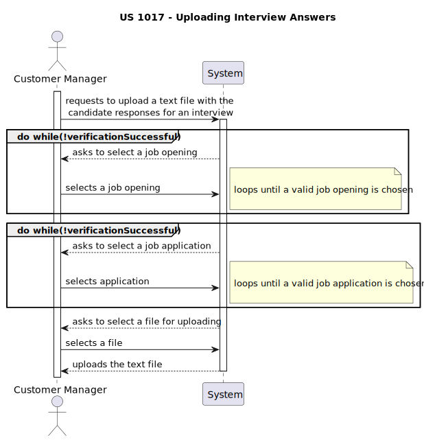
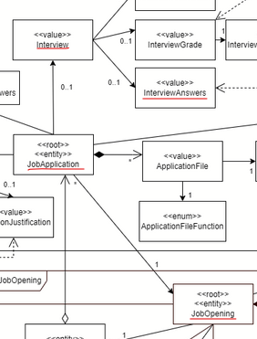
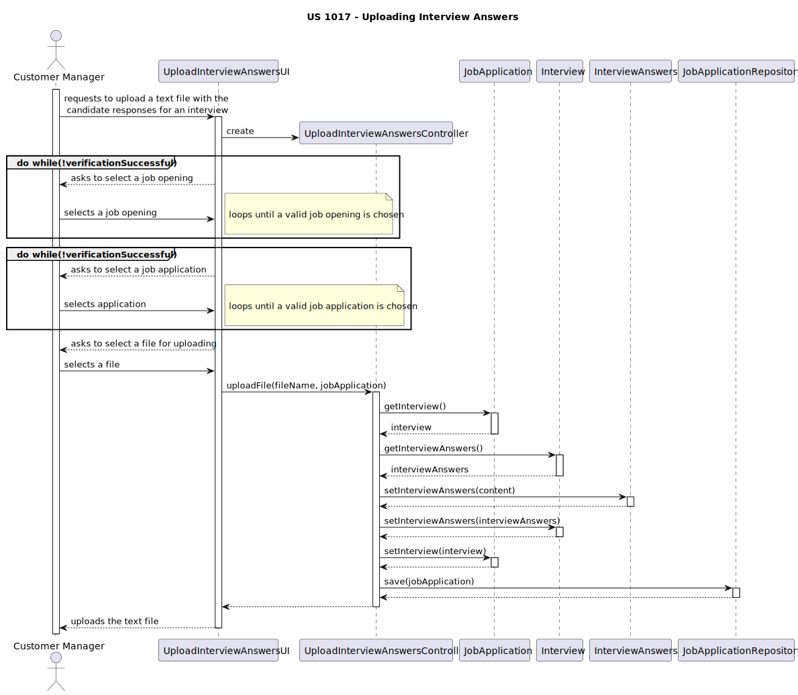

# US 1017
### As Customer Manager, I want to upload a text file with the candidate responses for an interview.
## 1. Context

* This US was assigned during the third **Sprint**.

## 2. Requirements

### 2.1. Dependencies

This US is dependent on [US2002](../../sprintB/us_2002/us2002.md) and [US1003](../../sprintB/us_1003/readme.md).

### 2.2. Pre-Conditions

There must me job openings and applications(and the candidates that submitted them) registered in the system for this user story to work as intended.

## 3. Analysis

### 3.1. Acceptance Criteria

**Acceptance Criteria:**

The customer manager must be able to upload the interview answers.

Thus, this is what the team envisioned the US would act like:



### 3.2 Analysis

**The domain model includes everything that's needed in order to perform this *US* as needed.**
* The sections in red show what is related to this *US*:



**Note:** No aggregate is altered during this process.

## 4. Design

All Design decisions regarding the classes used for this user story have already been made previously.

The relevant ones for this US are the repositories made. Out of all the classes involved in this user story, the only ones that have their own repositories are the JobApplication and the JobOpening classes, as they are the center class of each of their aggregates. The Interview and InterviewAnswers classes are part of the JobApplication's attributes and are saved through the JobApplication class. As such, to save the changes made to the Interview when the InterviewAnswers get uploaded, we need to save the state of the JobApplication to its respective repository after changing the Interview stored in the JobApplication.

These decisions are what led us to arrive at the sequence diagram bellow:



## 5. Tests

### 5.1. Tests

* Verify that the contents of the interview answers are correctly saved.

## 6. Implementation


This is how the Interview Answers file gets uploaded into the system:

```java
public void uploadFile(String fileName, JobApplication jobApplication) {
    String completeFilePath = FILEPATH+"/"+fileName;
    try {
        String content = new String(Files.readAllBytes(Paths.get(completeFilePath)));
        Interview interview = jobApplication.getInterview();
        InterviewAnswers interviewAnswers = interview.getInterviewAnswers();
        interviewAnswers.setInterviewAnswers(content);
        interview.setInterviewAnswers(interviewAnswers);
        jobApplication.setInterview(interview);
        jobApplicationRepository.save(jobApplication);
    } catch (IOException e) {
        e.printStackTrace();
    }
}
```

* This is the part of that method that extracts the contents of the file and sets it as the content inside of and InterviewAnswers instance:

```java
String content = new String(Files.readAllBytes(Paths.get(completeFilePath)));
Interview interview = jobApplication.getInterview();
InterviewAnswers interviewAnswers = interview.getInterviewAnswers();
interviewAnswers.setInterviewAnswers(content);
            
```

* And this is how that gets saved and "uploaded" into the database, following the considerations explained in the design section of this document:

```java
interview.setInterviewAnswers(interviewAnswers);
jobApplication.setInterview(interview);
jobApplicationRepository.save(jobApplication);
```

## 7. Integration

This *US* is part of the **Customer Manager's** *UI*.

Before running this user story, the functionalities of US1003 are run, as there is a need to list job opening in order for the customer manager to filter and find the application they want to set the interview answers for.

## 8. Demonstration

//TODO