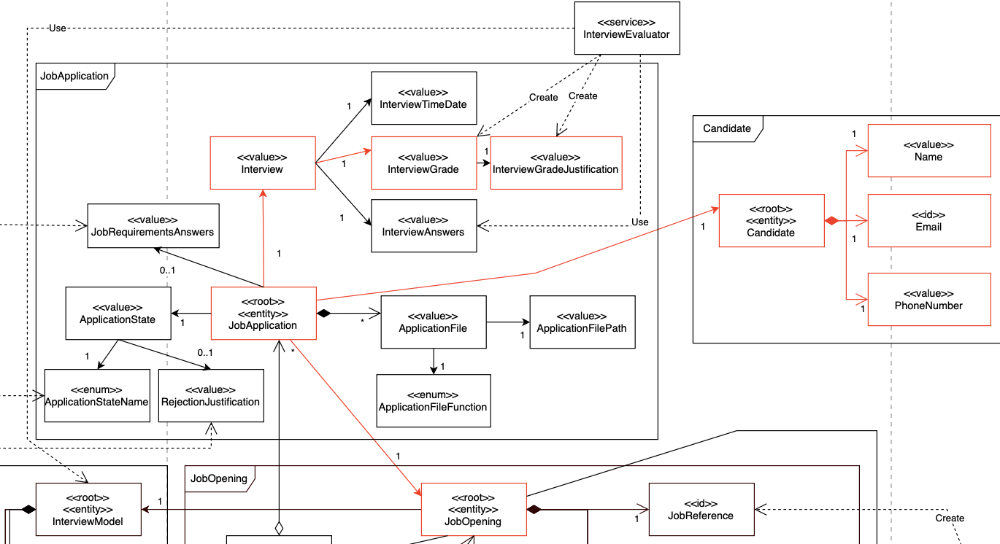

# US 1019
### As Customer Manager, I want to get an ordered list of candidates, using the job interview points (grades), to help me analyze the candidates
## 1. Context

* This US was assigned during the third **Sprint**.

## 2. Requirements

**Acceptance Criteria:**

- Regarding this user story List of Candidates shuld be ordered in a descending order regarding their grades.
- The Applications associated to the candidates have to have a interviews.
- The Job Applications must have a grade (Interview Grade).

### 2.2. Dependencies

* This *US* has a dependency on [**US 2000a**](../../sprintB/us_2000a) and on [**US 1018**](../../sprintC/us_1018).

### 2.3. Pre-Conditions

* A *Candidate* must be registered in the system (hence the dependency on **US 2000a**).
* The interview should have a grade set (hence the dependency on **US 1018**).
### 2.4 Open Questions

* **Question 1** Relativamente a esta user story 1019 A forma de ordenação é ascendente ou quer uma opção que inclua ascendente e descendente? **(Q169)**

* **Answer:** A ordenação é relativa a candidaturas para um job opening.A ordenação deve ser descendente, do que tem maior pontuação para o que tem menor pontuação.

* **Question 2:** é mencionado em questões anteriores : listagem ser ordenada descendentemente da nota da entrevista(como mencionado tambem na própria US), como idealiza a ordenação caso a job opening não possua entrevista? **(Q197)**

* **Answer:** Esta US não faz sentido para processos que não tenham entrevista.

* **Question 3:** Nesta user story , as notas da entrevista têm que ter obrigatoriamente uma justificação ?

* **Answer:** Sim - Deve ser possivel, para cada entrevista, saber a justfificação para a nota. 
Pode ser considerada justificação saber para cada pergunta a nota obtida e qual foi a resposta data pelo candidato (por exemplo).**(Q235)**

* **Question 4:** Nesta user story , a expressão "to help me analyze candidates" ,impõe que a job Opening esteja na fase de análise ?

* **Answer:**. Não vejo isso como uma obrigação, mas penso que faz mais sentido nessa fase admitindo que apenas nessa fase seja garantido que todas as entrevistas foram efetuadas e todos os candidatos “avaliados” pelas entrevistas **(Q236)**.
## 3. Analysis

The domain model includes necessary **concepts and classes** for the functionalities of this User Story, highlighted in red:

**Note:**  The current domain model ,is a changed verision of the orignal, regarding the explantion on  **Question 2** and **Question 3**:
- On this user story every application only exist with an interview and each interview withs its answers.

## 4. Design

- Ask user to select a job opening.
- Get all/Filter Job Applications **with interviews** from that job Opening.    --> **Information Expert:** Job Opening
- For each Application , display its Interview grade and candidate.

## 5. Implementation

## 5.1.Domain Rules verifying Tests

* Ensure the Current Job Opening is on analysis phase.
* Verify that al Job Applications have interviews
  * Verify every interview has a justification 
* Verify that the candidates are ordered in a descendent grades order:

## 6. Integration/Demonstration

* TODO

## 7. Observations

* TODO

