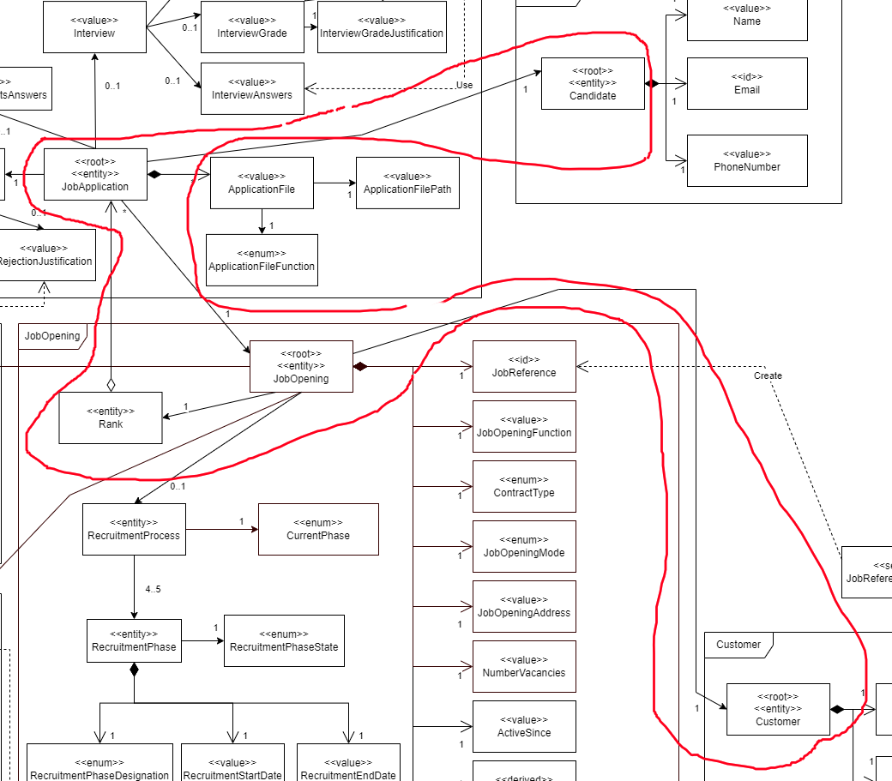
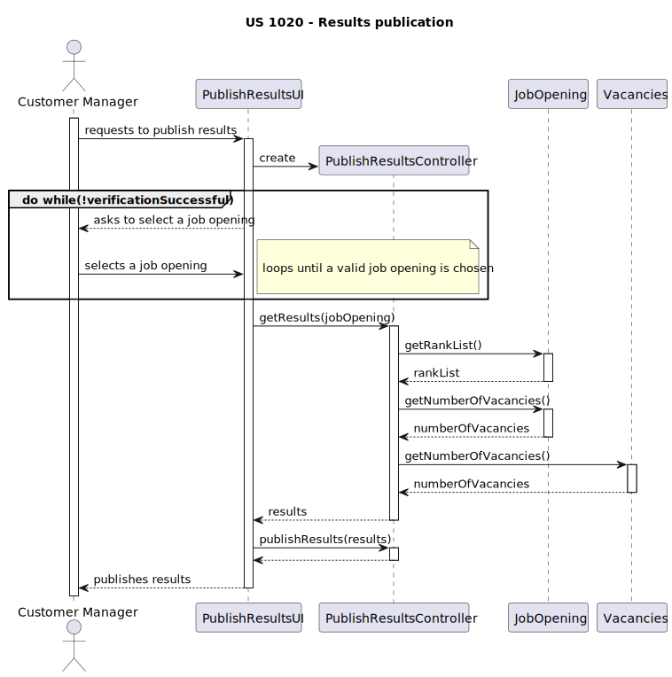

# US 1020
### As Customer Manager, I want to publish the results of the selection of candidates for a job opening, so that candidates and customer are notified by email of the result.
## 1. Context

* This US was assigned during the third **Sprint**.

## 2. Requirements

### 2.1. Dependencies

*  **NFR10(RCOMP):** The solution should be deployed using several network nodes. It is
   expected that, at least, the relational database server and the Follow Up Server be de-
   ployed in nodes different from localhost, preferably in the cloud. The e-mail notification
   tasks must be executed in background by the Follow Up Server.

* This *US* has a dependency on [**US 1013**](../../sprintC/us_1013/readme.md).

### 2.2. Pre-Conditions

The ranking must be complete in order for the candidates to be chosen. 

Only when a selection of candidates is available can the results be published.

### 2.3 Open Questions

```
Q48 Beatriz - US1016 and US1020, regarding the sending of notifications by email, is it necessary to register that the sending was complete?

A48. There is nothing of the sort explicit in the document. However, from the point of view of the management of the process of jobs4u, it seems adequate for that information to be registered.
```

```
Q51 Diogo – US 1020, what is the format for that publication?

A51. The publication refers to informing the candidates and the client, by email. The selected candidates should receive an email indicating that they were selected for their job opening and application and will be contacted by the entreprise. When it comes to the company, it should receive an email with the list of selected candidates, which must include the name, and contact information of the candidate.
```

```
Q190 Barbosa – US1020 – Regarding the selection of candidates, should we assume that the first N candidates in the ranking (where N is the number of job vacancies) are chosen, or should we allow the customer manager to select the N candidates?

A190. The first option (using the results from US1013). 
```

```
Q207 Sofia Cardoso – US1010 - Activate "Result" Face - It was already mentioned previously that for a phase to be in an "active" state it is necessary that the processes are ongoing. As such, what kind of processes does this phase have in order to make it take on an "active" state? I don't believe there is any US related to this phase.  

A207. In the "Result" phase, section 2.2.1: “candidates as well as customers are notified of the final result “. This segment is similar to US 1020's description. 
```

```
Q224 Pedro Guedes – US 1020 - This US demands that the application results are published, my question is if this process can only happen when the job opening is closed or if exectuing this operation would close it.

A224. This US related to the last phase of the process. If all notifications are sent with success, it is not wrong to assume that there is nothing left to do in this process. 
```

## 3. Analysis

### 3.1. Acceptance Criteria

* The candidates are correctly chosen.
* All notifications are sent with success.

### 3.2 Analysis

**From reading the system description, we can conclude that:**
* The user (Customer Manager) should select a job opening they are responsible for to finish its recruitment process (Executing the final stage: "Results"):
   * "As Customer Manager, I want to publish the results of the selection of candidates
     for a job opening, so that candidates and customer are notified by email of the result."

**From the feedback given by the *Product Owner*, we can conclude that:**
* The sending of the notifications should be registered (See **Question 48**).
* The publication of the results "refers to informing the candidates and the client, by email. The selected candidates should receive an email indicating that they were selected for their job opening and application and will be contacted by the entreprise. When it comes to the company, it should receive an email with the list of selected candidates, which must include the name, and contact information of the candidate." (See **Question 51**).
* This US's main process is automated, using the conclusions from another one of the available functionalities (US 1013) to calculate which candidates will be chosen (See **Question 190**).
* This US concludes the recruitment process (See **Question 224**).

**From reading the *RCOMP* system description, we can conclude that:**
* **TECHNICAL:** The system must use a **TCP Communication** between the client application and the **Follow Up Server** (See **Page 1**):
    * "It´s a TCP (Transmission Control Protocol) based client-server protocol."
* **TECHNICAL:** Each exchange between the client and the server should follow the following pattern (See **Page 1**):
    * "All message exchanges between the client application and the server application must follows
      a very restrict client-server pattern: the client application sends one request message, and the
      server application sends back one response message."
* **TECHNICAL:** These exchanges should be done with a certain format for each message (See **Page 2**):
    * 

**The domain model includes everything that's needed in order to perform this *US* as needed.**
* The sections in red show what is related to this *US*:

  

## 4. Design

Before publishing the results, in this user story, there is a need for selecting the candidates before publishing the results.

Here is the sequence diagram for how the results will be calculated:



Just as mentioned in A190 (See the Open Questions section in the requirements), the results will be calculated by filling in the vacancies with the top candidates in the ranking.

Only then can these results be published.


## 5. Tests

N/A

## 6. Implementation

## 7. Integration

## 8. Demonstration
