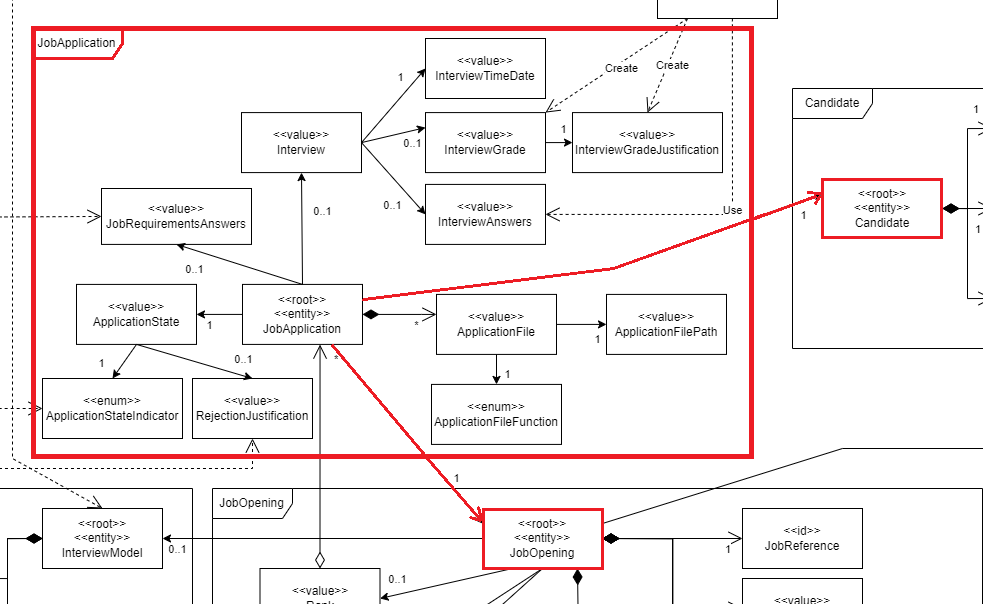
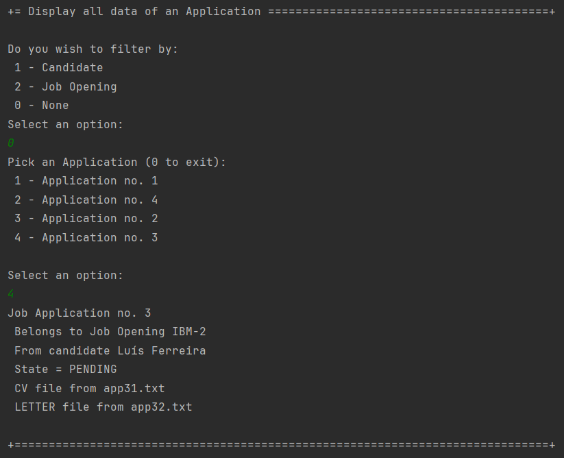
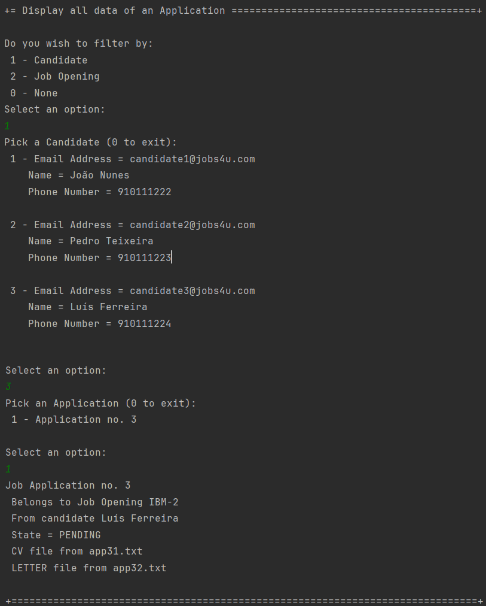
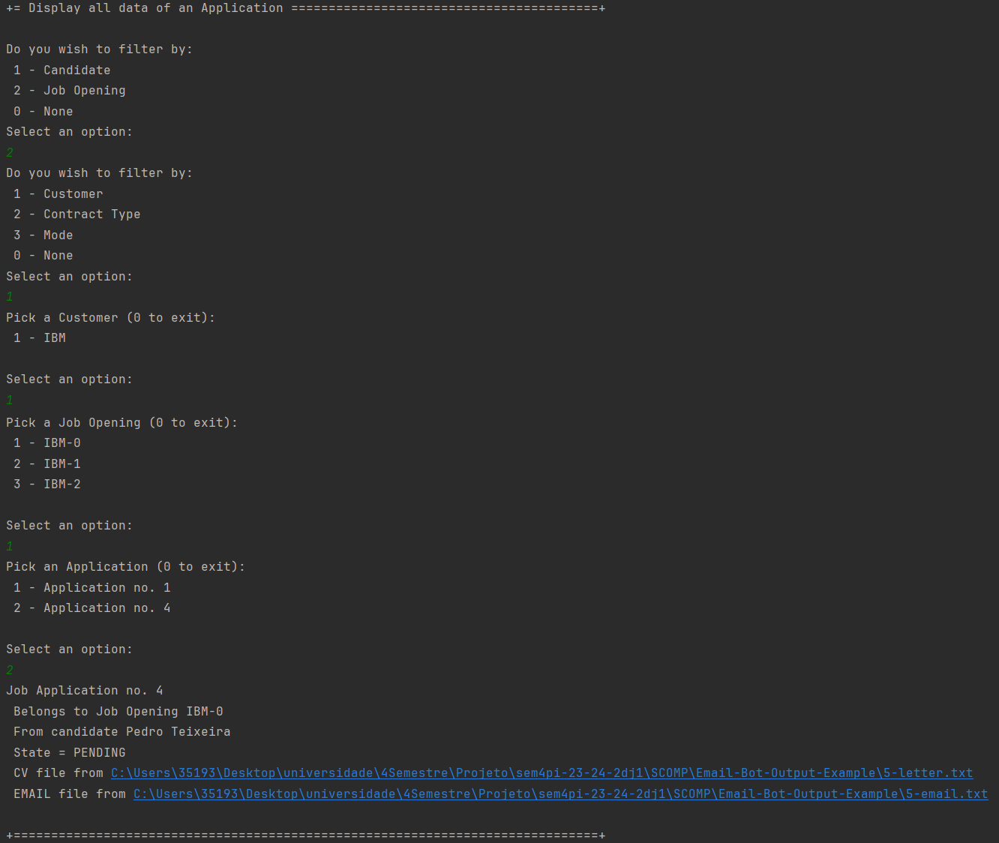

# US 1021

As **Customer Manager**, I want to display all the data of an application.

## 1. Context

This US was assigned during the third **Sprint**, as part of the *Customer Manager*'s use cases.

## 2. Requirements

### 2.1. Acceptance Criteria

* 1021.1. The team must ensure that, after choosing an *Application*, the system must display all of its data to the user.

Thus, this *US* would imply some listings with filters.

### 2.2. Dependencies

* This *US* has a dependency on [**US 2002**](../../sprintB/us_2002/us2002.md).

### 2.3. Pre-Conditions

* An *Application* must be registered in the system (hence the dependency on **US 2002**).

### 2.4 Open Questions

* **Question:** O que é "*all data of an application*"?
  * **Answer:** "*all data of an application*" refere-se a todos os dados de uma candidatura, nomeadamente, os ficheiros submetidos pelo candidato assim como dados recolhidos ou gerados durante o processo (como as entrevistas e processamento de requisitos).

## 3. Analysis

* The domain model includes everything that's needed in order to perform this *US* as needed.
* The sections in red show what is related to this *US*:
  

## 4. Design

The team decided to give the user some ways to filter the results (the *Job Applications*) before choosing.
* Filter by *Candidate*;
* Filter by *Job Openings*;
  * Filter *Job Openings* by Customer;
  * Filter *Job Openings* by Contract Type;
  * Filter *Job Openings* by Mode.

After choosing an *Application*, every detail is printed to the user. 

**Note:**
The function that gives the details is not the *Application*'s **toString()**, but another method inside that class. This is due to the fact that this class is the *information expert* regarding their own details.

## 5. Tests

### 5.1. Unit Tests

* Verify that all data is displayed;

  ```java
  @Test
  void ensureAllDataIsDisplayed(){
      JobApplication jobApplication = new JobApplicationBuilder()
              .withState(APPLICATION_STATE)
              .withFiles(APPLICATION_FILES)
              .forJobOpening(getJobOpening())
              .ofCandidate(CANDIDATE)
              .build();
      String details = jobApplication.details();
      assertTrue(details.contains("Opening") && details.contains("candidate") && details.contains("State")
                  && details.contains("CV") && details.contains("REPORT"));
  }
  ```

* Verify that the system doesn't show optional fields that weren't filled yet;

  ```java
  @Test
  void ensureNonFilledFieldsAreNotDisplayed(){
      JobApplication jobApplication = new JobApplicationBuilder()
              .withState(APPLICATION_STATE)
              .withFiles(APPLICATION_FILES)
              .forJobOpening(getJobOpening())
              .ofCandidate(CANDIDATE)
              .build();
      String details = jobApplication.details();
      assertFalse(details.contains("Requirements") || details.contains("Interview"));
  }
  ```

* Verify that the system shows optional fields that were filled.

  ```java
  @Test
  void ensureFilledFieldsAreDisplayed(){
      JobApplication jobApplication = new JobApplicationBuilder()
              .withState(APPLICATION_STATE)
              .withFiles(APPLICATION_FILES)
              .forJobOpening(getJobOpening())
              .ofCandidate(CANDIDATE)
              .withAddonInterview(INTERVIEW)
              .withAddonAnswers(REQUIREMENT_ANSWERS)
              .build();
      String details = jobApplication.details();
      assertTrue(details.contains("Requirements") && details.contains("Interview"));
  }
  ```

## 6. Implementation

In order to make sure that the codes gives the user the options to filter by *Job Opening*, by *Candidate*, or to not filter at all, the team needed to use a dynamic approach for this *US*'s code. Thus, we used the *Object* class, which encompasses all other classes.

For example:
```java 
private Object chooseFilterStyle(){
    System.out.printf("Do you wish to filter by:%n 1 - Candidate%n 2 - Job Opening%n 0 - None%n");
    return switch (Console.readOption(1, 2, 0)) {
        case 1 -> chooseCandidate();
        case 2 -> chooseOpeningFilterStyle();
        default -> null;
    };
}
```

Then, the program checks what class this *Object* is an instance of, and acts accordingly.

For example:

```java 
List<JobApplication> applications;
if(object == null) applications = controller.findAllApplications();
else if(object instanceof JobOpening) applications = controller.findJobApplicationsByJobOpening((JobOpening) object);
else applications = controller.findJobApplicationsByCandidate((Candidate) object);
```

**Note:** *null* is used if the user does not want to filter the results.

If there are any unexpected results, like there not being any *Candidates* in the system when the user asked to filter by *Candidate*, the method throws an **IllegalStateException**...

```java 
List<Candidate> candidates = controller.findCandidates();
if(candidates.isEmpty()) throw new IllegalStateException("There are no registered Candidates.");
```

...that is treated by the main method:

```java 
@Override
protected boolean doShow() {
    Object chosenFilter = chooseFilterStyle(), chosenObject;
    try {
        if (!(chosenFilter instanceof Candidate) && chosenFilter != null)
            chosenObject = chooseJobOpening(chosenFilter);
        else chosenObject = chosenFilter;
        JobApplication application = chooseApplication(chosenObject);
        if (application != null) System.out.println(application.details());
    } catch (IllegalStateException e) {
        System.out.printf("%s%nExiting!%n",e.getMessage());
    }
    return false;
}
```

## 7. Integration

As explained before, this *US* has a dependency on the **Register an Application** *US*, since it needs an *Application* on the system in order to list all of its details.

This *US* is part of the **Customer Manager's** *UI*.

## 8. Demonstration

Here, we are going to show the program running:

* Not filtering the results:

  

* Filtering by *Candidate*:

  

* Filtering by *Job Opening*, which are in turn filtered by *Customer*:

  
