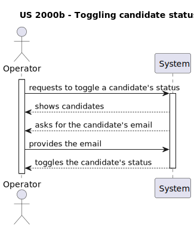
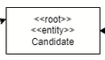
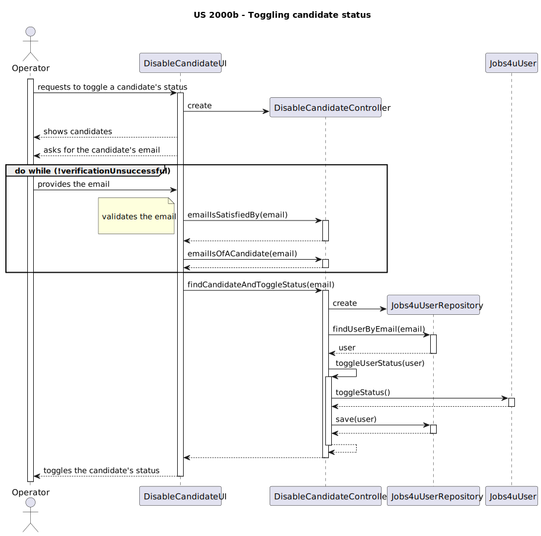
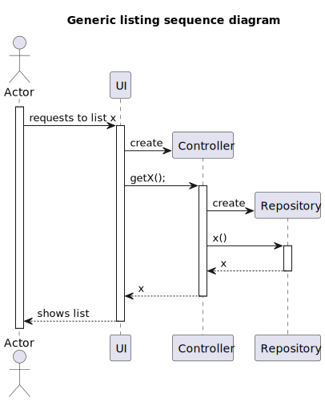

# US 2000b
### As Operator, I want to enable/disable a candidate

## 1. Context

* This US was assigned during the third **Sprint**.

## 2. Requirements

### 2.1. Dependencies

This User Story depends on [US2000a](../../sprintB/2000a/us_2000a) from Sprint B.

### 2.2. Pre-Conditions

There must be candidates registered in the system.

### 2.3 Open Questions

This user story is very straighforward and all the questions asked about it to the client were about the UI/UX and thus, not relevant, as pointed out by the Product Owner.

## 3. Analysis

### 3.1. Acceptance Criteria

**Acceptance Criteria:**

Enabled candidates must be able to log in the candidate application, while disabled candidates must not.

Thus, this is what the team envisioned the US would act like:



### 3.2 Analysis

From reading the system description, we can conclude that:
* Candidates can either be disabled or enabled.

From the feedback given by the *Product Owner*, we can conclude that:
* n/a

The domain model does not include any of the necessary classes for the functionalities of this User Story, except for the candidate class, since the rest isn't part of the business concept/model. This also means there is no need to extend the domain model.



Futhermore, there were some considerations made regarding usability when analyzing this user story:

This user story is fairly simple, not having required many design decisions besides the natural, most direct way of achieveing the required objectives. There is one single decision which could arguably be discarded, but was made in order to make the program as easy to use as possible: the way enabling and disabling candidates works.

A candidate can either be enabled or disabled. Moreover, to make it easier for the user to take the desired action, it is best to show all the candidates they could change the status of. This is what led us to decide that disabling or enabling a candidate is a toggle. That is, the Operator can decide to change the status of one of the displayed candidates and it will change to whichever one is not the state it is in at the time. For example, an enabled candidate would become disabled, and vice-versa.

## 4. Design

In terms of design, the only major decision was to add an enabled/disabled status as a boolean variable in candidate's respective Jobs4UUser instance.



When showing the candidate list to the user, this is how the program works:



...in which:

* Actor is the Operator;
* UI is DisableCandidateUI;
* Controller is DisableCandidateController;
* Repository is CandidateRepository;
* x is candidates.

## 5. Tests

### 5.1. Unit Tests

* Verify that the toggle works.

```java
    @Test
    void toggleStatus_shouldToggleUserStatus() {
        Username username = Username.valueOf("test_user");
        Password password = new Password("test_password");
        EmailAddress email = EmailAddress.valueOf("test@example.com");
        Jobs4uUserRoles role = Jobs4uUserRoles.CANDIDATE;
        boolean isEnabled = true;
        Jobs4uUser user = new Jobs4uUser(username, password, email, role, isEnabled);

        user.toggleStatus();

        assertFalse(user.isEnabled());
    }
```

## 6 Implementation

Here are some key snippets of code:

* This is how the selection of an email is verified:
```java 
    boolean verificationSuccessful = false;
    do{
        try{
            email = scanner.next();
            controller.emailIsSatisfiedBy(email);
            controller.emailIsOfACandidate(email);
            controller.findCandidateAndToggleStatus(email);
            verificationSuccessful = true;
        }catch(Exception e){
            System.out.println(e.getMessage());
            System.out.println("\nPlease try again.\n");
        }
    } while (!verificationSuccessful);
```

Let's take a look at each of the functions called by UI from the controller, with the purpose of verifying if the chosen job opening is valid, to understand how they work:

* **emailIsSatisfiedBy**
```java 
    public void emailIsSatisfiedBy(String rawEmail) {
        if (!rawEmail.matches("[a-zA-Z0-9]+@[a-zA-Z0-9]+\\.[a-zA-Z0-9]+")) {
            throw new IllegalArgumentException("\nInvalid email format. Email should be in the format: username@domain.com");
        }
    }
```

* **emailIsOfACandidate**
```java 
    public void emailIsOfACandidate(String rawEmail) {
        EmailAddress emailAddress = EmailAddress.valueOf(rawEmail);
        if(candidateRepository.findCandidateByEmailAddress(emailAddress) == null){
            throw new IllegalArgumentException("\nThere is no candidate registered with this email address. The available emails are available in the candidate list.");
        }
    }
```

## 7. Integration

As stated before, this *US* is dependant on the **Registering Candidates UI**, since registered candidates and their correspondant users are needed in order to be able to enable or disable them.

This *US* is part of the **Operator's** *UI*.

## 8. Demonstration

//TODO