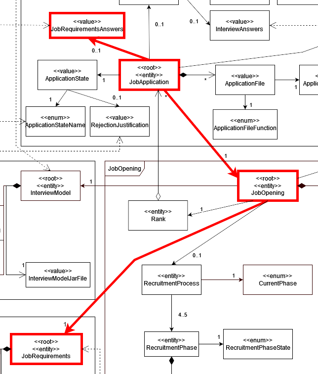
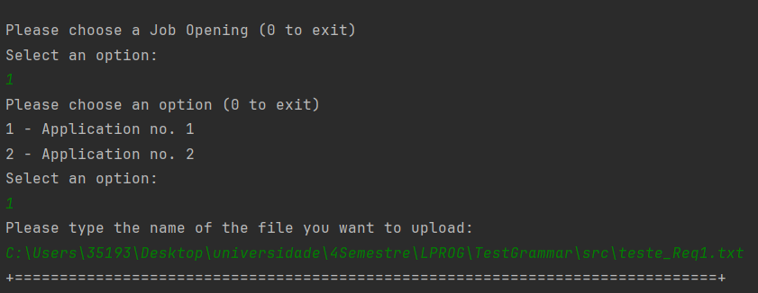

# US 2004
### As Operator, I want to upload a text file with the data fields (requirements ) of a candidate for its verification.
## 1. Context

* This US was assigned during the third **Sprint**.

## 2. Requirements

### 2.1. Dependencies

This US is dependent on [US1002](../../sprintB/us_1002/readme.md) and S2002](../../sprintB/us_2002/us2002.md).

### 2.2. Pre-Conditions

There must me job openings and applications registered in the system for this user story to work as intended.

### 2.3. Open Questions

* **Question 1:** US2004 - Requirements Answers - I'm having trouble understading where are the requirements answer obtained from the candidates, so that the operator can then register their answers in the template previously generated and submit them to the system. Are these answers already within the files processed by tge application fie bot?
    * **Answer 1:**  We can assume that the operator has access to all the files submitted by the candidates (since he/she is the one that imports the files into the system – US2002). He/she can than consult these files in order to answer the questions in the requirements template file. She/he then submits the file with the answers (US2004).

* **Question 2:** US2004 - Candidate Answers - Does US2004 only deals with the upload of the file to the system or also the registration of the candidate's answer by the Operator? I've seen many mentions about the file's answers but I want to understand if that aspect is also part of US2004.
    * **Answer 2:* In US 2004, the Operator uploads a file with the requirements and the system should validate the file (verify of the syntax is correct).

* **Question 3:** US 2004 - About the Us2004, when the Operator uploads the text file, in which phase is this US going to be?
    * **Answer 3:** All the files of the candidate must have been imported before. These files will be necessary for the operator to be able to answer the questions in the requirements specification template. Only then can the operator upload the file with the answers. This is the normal sequence. Regarding the phase of the process, I think it will depend on the proposed solution. I am open to solutions that do not invalidate the data consistency of the system.

## 3. Analysis

**From reading the system description, we can conclude that:**
* The user should be able to see all of **Job Applications** (See **Page 22**):
  * As Operator, I want to upload a text file with the data fields (requirements ) of a candidate for its verification.

**From the feedback given by the *Product Owner*, we can conclude that:**
* See **Question 1** the operator has access to all the files submitted by the candidates. He/she can than consult these files in order to answer the questions in the requirements template file. She/he then submits the file with the answers (US2004).
* See **Question 2** In US 2004, the Operator uploads a file with the requirements and the system should validate the file.
* See **Question 3** All the files of the candidate must have been imported before. These files will be necessary for the operator to be able to answer the questions in the requirements specification template. Only then can the operator upload the file with the answers. This is the normal sequence. Regarding the phase of the process, I think it will depend on the proposed solution. I am open to solutions that do not invalidate the data consistency of the system.

* **The domain model includes everything that's needed in order to perform this *US* as needed.**
* The sections in red show what is related to this *US*:

  

### 3.1. Acceptance Criteria

* 3000.1. the system should list them and the details mentioned beforehand;

## 4. Design

All Design decisions regarding the classes used for this user story have already been made previously.

The relevant ones for this US are the repositories made. Out of all the classes involved in this user story, the only ones that have their own repositories are the JobApplication and the JobOpening classes, as they are the center class of each of their aggregates. The Interview and InterviewAnswers classes are part of the JobApplication's attributes and are saved through the JobApplication class. As such, to save the changes made to the Interview when the InterviewAnswers get uploaded, we need to save the state of the JobApplication to its respective repository after changing the Interview stored in the JobApplication.

These decisions are what led us to arrive at the sequence diagram bellow:


## 5. Tests

### 5.1. Tests

* Verify that the Requirements are correctly saved.

## 6. Implementation

This is how the Requirements file gets uploaded into the system:

```java
public void uploadFile(String fileName, JobApplication jobApplication) throws IOException {
    String jobRequirementsAnswers = new String(Files.readAllBytes(Paths.get(fileName)));
    jobApplication.setJobRequirementsAnswers(jobRequirementsAnswers);
    jobApplicationRepository.save(jobApplication);
}
```
## 7. Integration

This *US* is part of the **Customer Manager's** *UI*.

Before running this user story, the functionalities of 1002 and 2002 must be implemented.

## 8. Demonstration

choosing the file path and uploading the file with the requirements answers.




