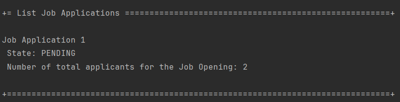

# US 3000

As Candidate, I want to list all my applications and their state (including the number of applicants).

## 1. Context

This US was assigned during the third **Sprint**, as part of the *Candidate*'s use cases, connecting to the **Follow-up Server**.

## 2. Requirements

### 2.1. Dependencies

*  **NFR10(RCOMP):** Functionalities related to the **Candidate** and **Customer** Apps and to the **Follow Up Server** part of the system have very specific technical requirements. It must follow a client-server architecture, where a client Job Application is used to access a server. Communications between these two components must follow specific protocol described in a document from **RCOMP** ("**Job Application Protocol**"). Also, the client Job Applications can not access the relational database, they can only access the server Job Application.
*  **NFR11(RCOMP):** The solution should be deployed using several network nodes. It is expected that, at least, the relational database server and the **Follow Up Server** be deployed in nodes different from *localhost*, preferably in the cloud. The e-mail notification tasks must be executed in background by the **Follow Up Server**.
* This *US* has a dependency on [**US 2002**](../../sprintB/us_2002/readme.md).

### 2.2. Pre-Conditions

* An *Job Application* must be registered in the system (hence the dependency on **US 2002**).
* The **Follow Up Server** must already be running when we run the **Candidate App**.

### 2.3. Open Questions

* **Question 1:** Na US3000 pede que, para alem de listar as aplicações e o estado das mesmas de um candidato, que liste o numero de candidatos. Este numero de candidatos é um somatório da quantidade de candidatos que fizeram uma aplicação para as mesmas Job Openings deste primeiro candidato (que esta a executar o caso de uso)?
    * **Answer 1:** Devem ser listadas todas as “applications” (candidaturas) do candidato, o estado delas, assim como o número de candidaturas que cada job opening teve (assim o candidato tem uma noção da “concorrência” que teve para cada uma das suas candidaturas).

## 3. Analysis

**From reading the system description, we can conclude that:**
* The user should be able to see all of their **Job Applications**, with their current *State* and **Number of Applicants** (See **Page 22**):
    * "As Candidate, I want to list all my applications and their state (including the number of applicants)."

**From reading the *RCOMP* system description, we can conclude that:**
* **TECHNICAL:** The system must use a **TCP Communication** between the client application and the **Follow Up Server** (See **Page 1**):
    * "It´s a TCP (Transmission Control Protocol) based client-server protocol."
* **TECHNICAL:** Each exchange between the client and the server should follow the following pattern (See **Page 1**):
    * "All message exchanges between the client application and the server application must follows
      a very restrict client-server pattern: the client application sends one request message, and the
      server application sends back one response message."
* **TECHNICAL:** These exchanges should be done with a certain format for each message (See **Page 2**):
    * 

**The domain model includes everything that's needed in order to perform this *US* as needed.**
* The sections in red show what is related to this *US*:

  

### 3.1. Acceptance Criteria

* 3000.1. If the current **Candidate** has any **Active Job Applications**, the system should list them and the details mentioned beforehand;
* 3002.1. If the current **Candidate** does not have any **Active Applciations**, the system tell the user.

## 4. Design

* **TECHNICAL:** New **Message Code Types** had to be created for this *US*, since none of the existing ones fullfilled what was needed.
    * **Message Code 10**:
      * **Name:** GETJOBAP;
      * **Type:** Request;
      * **Meaning:** Used for requesting a list of *Job Applications*, the **DATA1** field should carry the *Candidate username*, so that the *Job Applications* are filtered by *Candidate*.
    * **Message Code 11**:
      * **Name:** JOBAPLST;
      * **Type:** Response;
      * **Meaning:** Used for sending a list of *Job Applications*, each **DATA** field should carry the data about **one** *Job Application*.
* The *Job Application Repository* is responsible for giving us a list of Job Applications, as well as the **Number of Applicants** for each one.
* After requesting the data from the **Follow Up Server** (that comunicates with the database), the **Controller** (**ListJobApplicationsCandidateController**) will receive the *Job Application* list as a **JobApplicatioSmallDTO**. This **DTO** includes:
    * **Id**;
    * **State**;
    * **NumberApplicants**.

**Note:** This **DTO** is what will be sent by the **Follow Up Server** in the message with the **Message Code 11**, each instance of the **DTO** in the list of all *Job Applications* should occupy **one *DATA*** field of that **Message Format**.

## 5. Tests

N/A

## 6. Implementation

This is the section that reads an array of bytes and turns them into a **JobApplicationSmallDTO**.

```java
public JobApplicationSmallDTO(byte[] bytes) {
    byte[] result = new byte[4];
    int i = 0, j;
    for(int k=0;k<result.length;k++) result[k] = bytes[i++];
    id = new BigInteger(result).intValue();
    List<Byte> list = new ArrayList<>();
    while (bytes[i] != '0') list.add(bytes[i++]);
    i++;
    result = new byte[list.size()];
    for (int k = 0; k < list.size(); k++) result[k] = list.get(k);
    state = new String(result);
    result = new byte[8];
    for (j = 0; j < result.length; j++) result[j] = bytes[i++];
    numApplicants = new BigInteger(result).longValue();
}
```

## 7. Integration

This is part of the **Candidate** menu, separated from the database, accessing the **Follow Up Server**.

## 8. Demonstration


