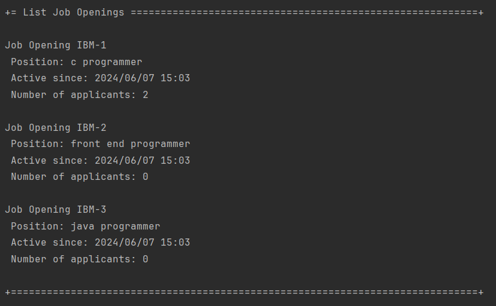

# US 3002

As **Customer**, I want to list all my job openings, including job reference, position, active since, number of applicants.

## 1. Context

This US was assigned during the third **Sprint**, as part of the *Customer*'s use cases, connecting to the **Follow-up Server**.

## 2. Requirements

### 2.1. Dependencies

*  **NFR10(RCOMP):** Functionalities related to the **Candidate** and **Customer** Apps and to the **Follow Up Server** part of the system have very specific technical requirements. It must follow a client-server architecture, where a client application is used to access a server. Communications between these two components must follow specific protocol described in a document from **RCOMP** ("**Application Protocol**"). Also, the client applications can not access the relational database, they can only access the server application.
*  **NFR11(RCOMP):** The solution should be deployed using several network nodes. It is expected that, at least, the relational database server and the **Follow Up Server** be deployed in nodes different from *localhost*, preferably in the cloud. The e-mail notification tasks must be executed in background by the **Follow Up Server**.
* This *US* has a dependency on [**US 1002**](../../sprintB/us_1002/readme.md).

### 2.2. Pre-Conditions

* A *Job Opening* must be registered in the system (hence the dependency on **US 1002**).
* The **Follow Up Server** must already be running when we run the **Customer App**.

### 2.3. Open Questions

* **Question 1:** You stated that one of the this to show in the listing of job openings is "active since". You've clarified that an active job opening is the one where its recruitment process is on-going. Are the job openings listed in this funcionality only the ones with recruitment process on-going? Or also the ones without recruitment processes, the ones with processes that haven't yet started or have ended?
    * **Answer 1:** In the context of this US, “active since” means the date from the start of the process, the “application” phase (since that date, candidates can apply). This functionality should include all the “active” job openings.
* **Question 2:** O que é "Position"?
    * **Answer 2:** Nessa US quando referimos “position” tem o mesmo significado que “title or function” na secção 2.2.2. 

## 3. Analysis

**From reading the system description, we can conclude that:**
* The user should be able to see all of their **Job Openings**, and certain attributes of each one (**Job Reference**, **Position**, **Active Since**, **Number of Applicants**) (See **Page 22**):
  * "As Customer, I want to list all my job openings, including job reference, position,
    active since, number of applicants."

**From the feedback given by the *Product Owner*, we can conclude that:**
* The user should only be able to see their **Active Job Openings** (See **Question 2**);

**From reading the *RCOMP* system description, we can conclude that:**
* **TECHNICAL:** The system must use a **TCP Communication** between the client application and the **Follow Up Server** (See **Page 1**):
  * "It´s a TCP (Transmission Control Protocol) based client-server protocol."
* **TECHNICAL:** Each exchange between the client and the server should follow the following pattern (See **Page 1**):
  * "All message exchanges between the client application and the server application must follows
    a very restrict client-server pattern: the client application sends one request message, and the
    server application sends back one response message."
* **TECHNICAL:** These exchanges should be done with a certain format for each message (See **Page 2**):
  * 

**The domain model includes everything that's needed in order to perform this *US* as needed.**
* The sections in red show what is related to this *US*:

  

  **Note:** As specified by **Question 1**, the **Position** mentioned in the *System Description* is our **JobOpeningFunction** object.

### 3.1. Acceptance Criteria

* 3002.1. If the current **Customer** has any **Active Job Openings**, the system should list them and the details mentioned beforehand;
* 3002.1. If the current **Customer** does not have any **Active Job Openings**, the system tell the user.

## 4. Design

* **TECHNICAL:** New **Message Code Types** had to be created for this *US*, since none of the existing ones fullfilled what was needed.
  * **Message Code 5**:
    * **Name:** GETJOBOP;
    * **Type:** Request;
    * **Meaning:** Used for requesting a list of *Job Openings*, the **DATA1** field should carry the *Customer email*, so that the *Job Openings* are filtered by *Customer*.
  * **Message Code 6**:
    * **Name:** JOBOPLST
    * **Type:** Response;
    * **Meaning:** Used for sending a list of *Job Openings*, each **DATA** field should carry the data about **one** *Job Opening*.
* The *Job Opening Repository* is responsible for giving us a list of Job Openings, as well as the **Number of Applicants** for each one.
* After requesting the data from the **Follow Up Server** (that comunicates with the database), the program will receive the *Job Opening* list as a **JobOpeningSmallDTO**. This **DTO** includes:
  * **JobReference**;
    * This is passed as a String that ends with *null*.
  * **JobOpeningFunction**;
    * This is passed as a String that ends with *null*.
  * **ActiveSince**;
    * This is passed as a long with the following format:
      * "2024/04/04 15:30" would look like "202404041530"
  * **NumberApplicants**.
    * This is passed as a *long*.
  
**Note:** This **DTO** is what will be sent by the **Follow Up Server** in the message with the **Message Code 6**, each instance of the **DTO** in the list of all *Job Openings* should occupy **one *DATA*** field of that **Message Format**.

## 5. Tests

N/A

## 6. Implementation

This is the section that reads an array of bytes and turns them into a **JobOpeningSmallDTO**.

```java
public JobOpeningSmallDTO(byte[] bytes){
    List<Byte> list = new ArrayList<>();
    int i = 0, j;
    while(bytes[i] != '0'){
        list.add(bytes[i++]);
    }
    i++;
    byte[] result = new byte[list.size()];
    for(int k = 0; k < list.size(); k++) result[k] = list.get(k);
    jobReference = new String(result);
    list = new ArrayList<>();
    while(bytes[i] != '0'){
        list.add(bytes[i++]);
    }
    i++;
    result = new byte[list.size()];
    for(int k = 0; k < list.size(); k++) result[k] = list.get(k);
    position = new String(result);
    result = new byte[8];
    for(j=0;j<result.length;j++){
        result[j] = bytes[i++];
    }
    activeSince = new BigInteger(result).longValue();
    result = new byte[8];
    for(j=0;j<result.length;j++){
        result[j] = bytes[i++];
    }
    numApplicants = new BigInteger(result).longValue();
}
```

This is done for each DATA field of the message received from the **Follow Up Server**.

All the received and translated *Job Openings* are then listed as requested.

## 7. Integration

This is part of the **Customer** menu, separated from the database, accessing the **Follow Up Server**.

## 8. Demonstration



