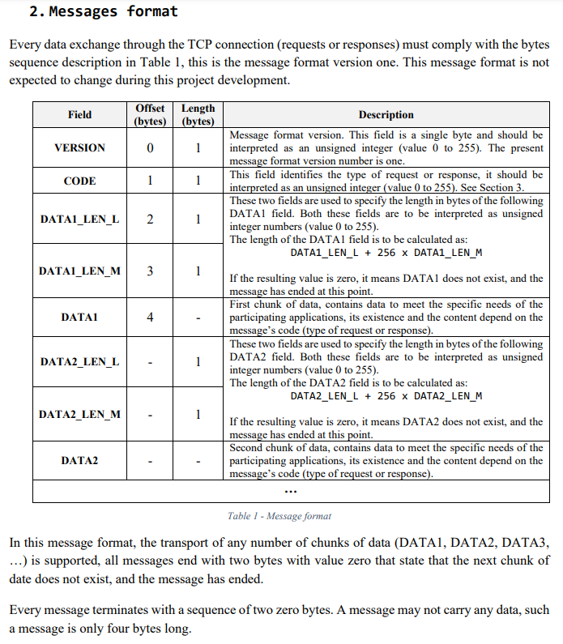
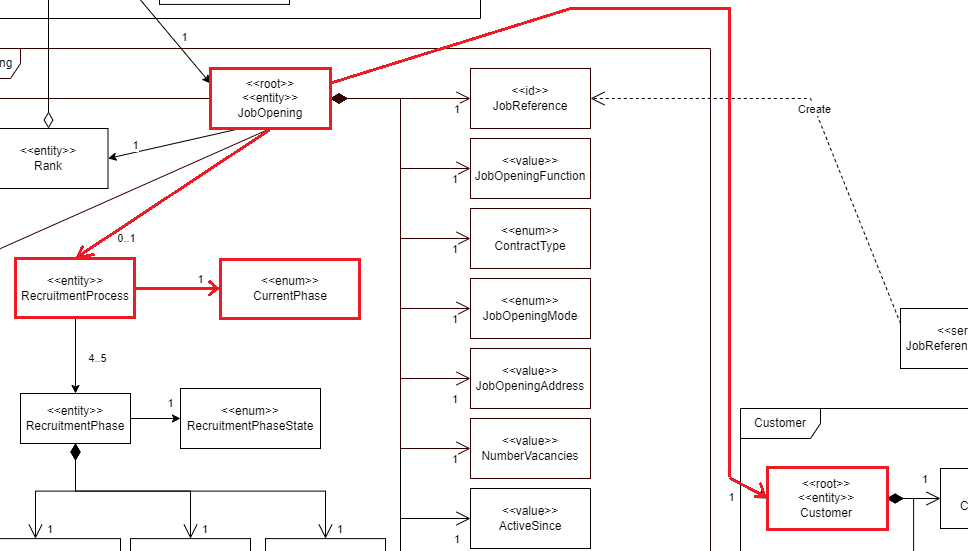
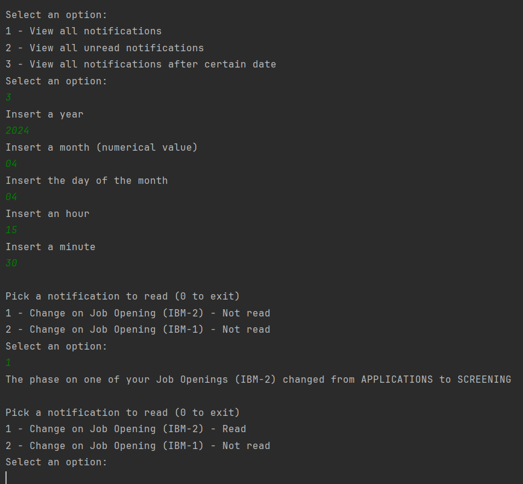

# US 3003

As **Customer**, I want to be notified in my application when the state (phase) of my job openings changes.

## 1. Context

This US was assigned during the third **Sprint**, as part of the *Customer*'s use cases, connecting to the **Follow-up Server**.

## 2. Requirements

### 2.1. Dependencies

*  **NFR10(RCOMP):** Functionalities related to the **Candidate** and **Customer** Apps and to the **Follow Up Server** part of the system have very specific technical requirements. It must follow a client-server architecture, where a client application is used to access a server. Communications between these two components must follow specific protocol described in a document from **RCOMP** ("**Application Protocol**"). Also, the client applications can not access the relational database, they can only access the server application.
*  **NFR11(RCOMP):** The solution should be deployed using several network nodes. It is expected that, at least, the relational database server and the **Follow Up Server** be deployed in nodes different from *localhost*, preferably in the cloud. The e-mail notification tasks must be executed in background by the **Follow Up Server**.
* This *US* has a dependency on [**US 1010**](../../sprintC/us_1010/readme.md).

### 2.2. Pre-Conditions

* A *Job Opening* must be registered in the system;
  * It must be possible for the job opening to switch phases (hence the dependency on **US 1010**).
* The **Follow Up Server** must already be running when we run the **Customer App**.

### 2.3. Open Questions

* **Question 1:** No âmbito da visualização de notificações na app de cliente deseja que a listagem tenha algo em específico por exemplo, apenas as não lidas (consequentement terá de haver uma opção marcar como lida).
    * **Answer 1:** Sim, para mim faz sentido que o conceito de notificação tenha uma opção de marcar como lida a notificação. Deve ser possível ver as notificações “já lidas” (algo como ver “todas” ou ver “todas a partir de uma data”).

## 3. Analysis

**From reading the system description, we can conclude that:**
* These notifications must appear in the **Customer App**, not to be confused with the *email notifications* mentioned in other *User Stories* (See **Page 22**):
  * "As Customer, I want to be notified in my application when the state (phase) of my job openings changes."
    * Thus, these notifications must be persisted in the database. This way, the notifications are created at a certain instant, saved on the database, and then the **Customer** can see them at any point afterwards.

**From the feedback given by the *Product Owner*, we can conclude that:**
* Already read notifications shouldn't be deleted, but there should be a distinction between read notifications an non-read notifications. There should also be a date associated with each notification (See **Question 1**);

**From reading the *RCOMP* system description, we can conclude that:**
* **TECHNICAL:** The system must use a **TCP Communication** between the client application and the **Follow Up Server** (See **Page 1**):
  * "It´s a TCP (Transmission Control Protocol) based client-server protocol."
* **TECHNICAL:** Each exchange between the client and the server should follow the following pattern (See **Page 1**):
  * "All message exchanges between the client application and the server application must follows
    a very restrict client-server pattern: the client application sends one request message, and the
    server application sends back one response message."
* **TECHNICAL:** These exchanges should be done with a certain format for each message (See **Page 2**):
  * 

**The domain model doesn't include everything that's needed in order to perform this *US* as needed.**
* The sections in red show what is related to this *US*:

  

* There should also be a sepparate aggregate regarding **Notifications**.

### 3.1 Acceptance Criteria

* 3003.1. If there are no notifications (read nor unread), tell that to the user;
* 3003.2. If there area any unread notifications for that customer, list them;
* 3003.3. Give the option to list already read notifications.

## 4. Design

* **TECHNICAL:** New **Message Code Types** had to be created for this *US*, since none of the existing ones fullfilled what was needed.
  * **Message Code 7**:
    * **Name:** GETNOTIFS;
    * **Type:** Request;
    * **Meaning:** Used for requesting a list of *Notifications*, the **DATA1** field should carry the *current user email*, so that the *Notifications* are filtered by that *User*, the **DATA2** field should carry:
      * 1 if they want to see all notifications;
      * 2 if they only want to see unread notifications;
      * Date in yyyyMMddHHmm format if they want to see all notifications after that point.
  * **Message Code 8**:
    * **Name:** NOTIFLST;
    * **Type:** Response;
    * **Meaning:** Used for sending a list of *Notifications*, each **DATA** field should carry the data about **one** *Notification*.
  * **Message Code 9**:
    * **Name:** READNOTIF;
    * **Type:** Request;
    * **Meaning:** Used for telling the **Follow Up Server** that the user has read a notification, the **DATA1** field should carry the id of the specific **Notification**. The answer from the **Follow Up Server** should be either **ACK** or **ERR**.

* We had to create a new object called **Notification**. This class contains:
  * Email address of the recipient;
  * Title;
  * Content;
  * Date when notification was created;
  * If it was already read or not.
* We also had to create a DTO called **NotificationDTO**, this DTO contains:
  * Email address of the recipient;
    * This is passed as a String that ends with *null*.
  * Title;
    * This is passed as a String that ends with *null*.
  * Content;
    * This is passed as a String that ends with *null*.
  * Date when notification was created;
    * This is passed as a long with the following format:
      * "2024/04/04 15:30" would look like "202404041530"
  * If it was already read or not.
    * This is passed as a boolean. **True** for *read* and **false** for *unread*.

## 5. Tests

N/A

## 6. Implementation

This is the section that reads an array of bytes and turns them into a **NotificationDTO**.

```java
public NotificationDTO(byte[] bytes){
    List<Byte> list = new ArrayList<>();
    int i = 0;
    byte[] result = new byte[8];
    for(int k=0;k<result.length;k++) result[k] = bytes[i++]; //id
    id = new BigInteger(result).longValue();
    while(bytes[i] != '0') list.add(bytes[i++]); //recipient
    i++;
    result = new byte[list.size()];
    for(int k=0;k<result.length;k++) result[k] = list.get(k);
    recipient = new String(result);
    list = new ArrayList<>();
    while(bytes[i] != '0') list.add(bytes[i++]); //title
    i++;
    result = new byte[list.size()];
    for(int k=0;k<result.length;k++) result[k] = list.get(k);
    title = new String(result);
    list = new ArrayList<>();
    while(bytes[i] != '0') list.add(bytes[i++]); //content
    i++;
    result = new byte[list.size()];
    for(int k=0;k<result.length;k++) result[k] = list.get(k);
    content = new String(result);
    result = new byte[8];
    for(int k=0;k<result.length;k++) result[k] = bytes[i++]; //id
    time = new BigInteger(result).longValue();
    read = bytes[i] != (byte)0;
}
```

This is done for each DATA field of the message received from the **Follow Up Server**.

All the received and translated *Notifications* are then listed as requested.

```java 
private void readNotifications(List<NotificationDTO> dtos) throws IOException {
    int option;
    while(true){
        System.out.printf("%nPick a notification to read (0 to exit)%n");
        for(int i = 0; i < dtos.size(); i++) System.out.printf("%d - %s - %s%n", (i+1), dtos.get(i).getTitle(), dtos.get(i).isRead() ? "Read" : "Not read");
        option = Console.readOption(1,dtos.size(),0);
        if(option == 0) return;
        System.out.println(dtos.get(option-1).getContent());
        if(!dtos.get(option-1).isRead()){
            List<Byte> bytes = new ArrayList<>();
            bytes.add(VERSION);
            bytes.add(MessageCode.READNOTIF.getValue());
            MessageEncoder.addBytesFromLong(bytes, dtos.get(option-1).getId());
            bytes.add((byte)0); bytes.add((byte)0);
            sOut.write(MessageReader.getArrayOfBytes(bytes));
            MessageFormat format = MessageReader.readMessage(sIn);
            dtos.get(option-1).read();
            assert format != null;
            if(format.getCode().equals(MessageCode.ERR)) return;
        }
    }
}
```

The user has to choose a notification from its title, this will show its content and mark it as read if it wasn't already.

## 7. Integration

This is part of the **Customer** menu, separated from the database, accessing the **Follow Up Server**.

## 8. Demonstration


