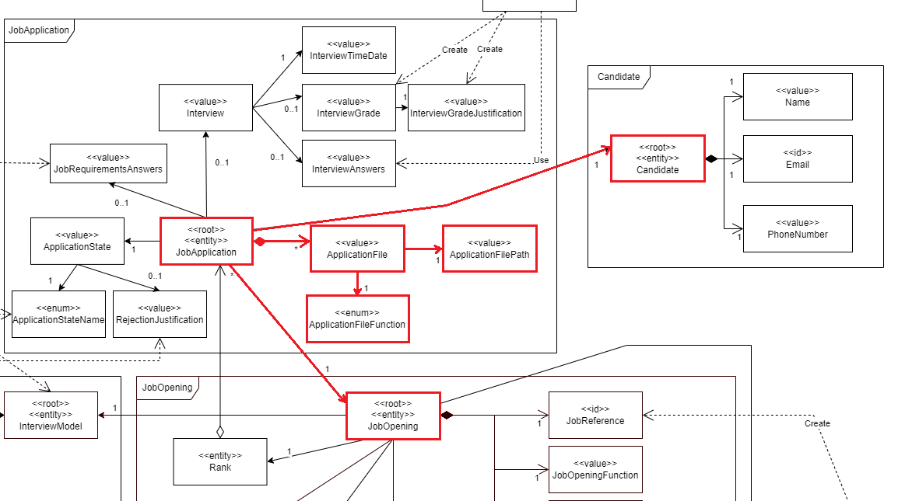
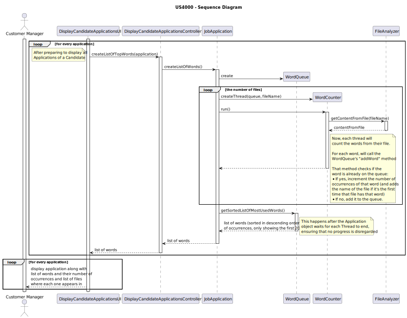
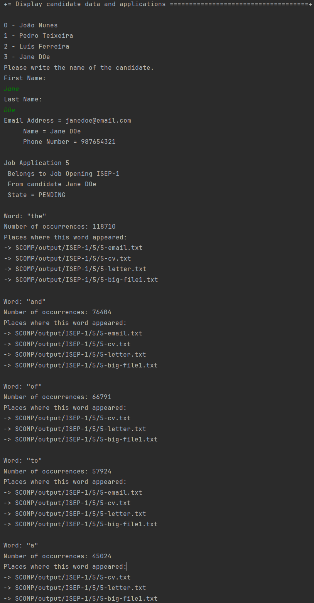

# US 4000

As a **Customer Manager**, when displaying the candidate data, I expect the system to **present a top 20 list of the most frequently referenced words** from **files uploaded by a candidate**. Additionally, I require a comprehensive list of the files in which these words appear.

## 1. Context

This US was assigned during the third **Sprint**, as part of the *Customer Manager*'s use cases.

## 2. Requirements

### 2.1. Acceptance Criteria

* 4000.1. The team must ensure that all files **of one of the *Candidate*'s *Applications*** are analyzed, even the "big" ones.

### 2.2. Dependencies

*  **NFR14(SCOMP):** The process to count words of very large files should follow specific
   technical requirements such as implementing parallelism and concurrency using *Java*
   and threads. Specific requirements will be provided in *SCOMP*.
* This *US* has a dependency on [**US 2000**](../../sprintB/2000a/us_2000a).
* This *US* has a dependency on [**US 2002**](../../sprintB/us_2002/us2002.md).
* This *US* has a dependency on [**US 1006b**](../../sprintB/us_1006b/readme.md).

### 2.3. Pre-Conditions

* A *Candidate* must be registered in the system (hence the dependency on **US 2000a**).
* An *Application* must be registered in the system (hence the dependency on **US 2002**).
* There must already exist an option to display all of a *Candidate*'s data (hence the dependency on **US 1006b**).

### 2.4 Open Questions

* **Question 1:** Gostaria de saber se na US4000, relativa há criação da lista de palavras mais comuns, presentes nos ficheiros carregados pelo candidato, pretende escolher uma candidatura desse mesmo candidato e criar a respetiva lista, ou se pretende que esta lista seja criada, tendo em conta todas as candidaturas associadas a esse candidato.
    * **Answer 1:** A lista de palavras é relativa a uma candidatura em particular.


* **Question 2:** For the word count, should all types of words be counted, or are there words that don't make sense to count, such as conjunctions?
  *  **Answer 2:** For the moment there are no restrictions like the one you mention since they depend on the language used in the text (the solution could/would be complex).


* **Question 3:** I think it makes sense to ignore words with less than 3 letters, or something like this, because it makes no sense to have words like as, I, am... Can we make this assumption or should we count any word?
  *  **Answer 3:** If you want, you may use a configuration file to configure the minimum number of sequence of characters to be counted as a word in the process. However, this is a temporary exception, accepted, but not considered as a good solution (a good solution should be one that takes into account the used language).


* **Question 4:** The order of the list is important? Does it need to be ordered by the number of occurrences of the words?
  * **Answer 4:** Yes, the order is important. The system must present a top 20 list, from most referenced words to less referenced words.


* **Question 5:** Ficámos na dúvida sobre qual a interpretação a levar em conta, de que a funcionalidade deve ser feita sobre todas as candidaturas do candidato, ou se o *Customer Manager* escolhe 1 candidatura do candidato e depois a funcionalidade faz o seu trabalho sobre **apenas** essa candidatura.
  * **Answer 5:** Os dados do candidato (“candidate data”) referem-se aos dados do candidato que pode ter várias candidaturas. Nesse contexto ao apresentar os dados de cada candidatura devem aparecer, para cada candidatura (application), o top 20.

## 3. Analysis

**From reading the system description, we can conclude that:**

* This *Use Case* should present a top 20 list of the most used words (See **Page 23**):
    * "I expect the system to present a top 20 list of the most frequently referenced words from files uploaded by a candidate."
* It should also, for each word, present a list of the files where it appears (See **Page 23**):
  * "Additionally, I require a comprehensive list of the files in which these words appear"

**From reading the details from **SCOMP**'s document regarding **NFR14**, we can conclude that:**
* **TECHNICAL DETAIL:** The usage of any *Java concurrency mechanisms* that weren't taught during class is forbidden (See **Page 2**):
  * "Utilization of any Java concurrency mechanisms beyond those covered in class, including thread pools, streams, etc., is strictly prohibited."
* **TECHNICAL DETAIL:** We are given the **choice** on the method to process files, but synchronization between *Threads* are necessary (See **Page 2**):
  * "Multiple approaches can be taken for processing files: either assigning a thread per
    file or allowing multiple threads to process a single file. Nevertheless,
    synchronization among threads is imperative to guarantee the accuracy of the
    obtained results."
* Each word should also display the number of occurrences (See **Page 2**):
  * "This list should include the number of occurrences of each word and the corresponding files in which they appear."

**From the feedback given by the *Product Owner*, we can conclude that:**
* The list of words is not regarding every *Application* of that *Candidate*. Each list is about one *Application* (See **Question 1**);
* All words should be counted, even, for example, conjunctions (See **Question 2**);
* The words should be ordered by descending order of occurrences (See **Question 4**);
* This process should be done for all *Applications* of a *Candidate* when displaying their info. The user doesn't choose one *Application* beforehand (See **Question 5**).


**The domain model includes everything that's needed in order to perform this *US* as needed.**
* The sections in red show what is related to this *US*:

  
  **Note:** No aggregate is altered during this process.

## 4. Design

* Due to the *Product Owner*'s answer to **Question 2**, we decided to consider every word, regardless of language. This is because company's names don't always abide by a fixed dictionary (For example, *Cisco*, *Lenovo*, *IKEA*, *L'Oréal*, etc.).
  * This means that we didn't do what they suggested in their answer to **Question 3**, due to that method being, as they described it, "accepted, but not considered a good solution".
* **USABILITY:** Since this is to happen after displaying all of a candidate's data, this functionality is a continuation of that one, being inserted in the same **UI** (**DisplayCandidateApplicationsUI**) and **Controller** (**DisplayCandidateApplicationsController**).
* We need to create a class with a list where each entry has a **word**, the **list of files** where that **word** appears, and the **number of occurrences** of that **word**. That class will be named **WordQueue**.
  * This class will have a **synchronized** method that receives a word and a filename:
    * If the word is new, add it to the list;
    * If the word is not new, but the file where it appeared in is, add that file to that word's list of origins, and increment the word's occurrences;
    * If the word is not new, and it has already been found on that file, only increment its number of occurrences.
  * This class will also have the responsibility of sorting the list of words in descending order of occurrences, as requested in **Question 4**.
* We also need a class that will be used by each thread (thus, implementing the **Runnable** *interface*). This class will need to access the **WordQueue**'s list, making sure that any changes done are synchronized. It will be named **WordCounter**.
  * This class' **run** method will have to, for each word, call the previously mentioned method of the **WordQueue** class:
* The responsability for creating the **WordQueue** and running the various **WordCounters** was given to the domain object **JobApplication**, since it's a task relevant to it.

Thus, these design decisions created this *Sequence Diagram*.



## 5. Tests

### 5.1. Unit Tests

* Verify that the words are listed in descending order of occurrence (Because of **Question 4**);
  ```java
  @Test
  void assertListOfWordsAreInDescendingOrder() throws InterruptedException {
      JobApplication jobApplication = new JobApplicationBuilder()
              .withId(6)
              .withState(APPLICATION_STATE)
              .forJobOpening(getJobOpening())
              .withFiles(PATH_TO_APPLICATION_FILES)
              .ofCandidate(CANDIDATE)
              .withAddonInterview(INTERVIEW)
              .withAddonAnswers(REQUIREMENT_ANSWERS)
              .build();
      List<Map.Entry<String, Map.Entry<List<String>, Integer>>> list = jobApplication.createListOfWords(20);
      for(int i = 1; i < list.size(); i++)
          if(list.get(i).getValue().getValue() > list.get(i-1).getValue().getValue())
              fail();
  }
  ```

### 5.2. Consistency Tests

* Verify that the words appear where the results indicate;

  ```java
  @Test
  void assertEachEntryHasListOfFileAppearances() throws InterruptedException {
      JobApplication jobApplication = new JobApplicationBuilder()
              .withId(6)
              .withState(APPLICATION_STATE)
              .forJobOpening(getJobOpening())
              .withFiles(PATH_TO_APPLICATION_FILES)
              .ofCandidate(CANDIDATE)
              .withAddonInterview(INTERVIEW)
              .withAddonAnswers(REQUIREMENT_ANSWERS)
              .build();
      List<Map.Entry<String, Map.Entry<List<String>, Integer>>> list = jobApplication.createListOfWords(20);
      for(Map.Entry<String, Map.Entry<List<String>, Integer>> entry : list)
          if (entry.getValue().getKey().isEmpty())
              fail();
  }
  ```
  
* Verify that the number of occurrences for each word is correct (In order to verify synchronization);

  ```java
  @Test
  void assertNumOccurrencesIsCorrect() throws InterruptedException {
      //This is specifically for files from job application nº6 without the 6-big-file1.txt
      JobApplication jobApplication = new JobApplicationBuilder()
              .withId(6)
              .withState(APPLICATION_STATE)
              .forJobOpening(getJobOpening())
              .withFiles(PATH_TO_APPLICATION_FILES)
              .ofCandidate(CANDIDATE)
              .withAddonInterview(INTERVIEW)
              .withAddonAnswers(REQUIREMENT_ANSWERS)
              .build();
      List<String> words = Arrays.stream("and to a the with jane of i software her in she development 1 company xyz skills am team has".split(" ")).toList();
      List<Integer> occurrences = Arrays.asList(20, 19, 11, 11, 8, 8, 8, 7, 7, 7, 7, 6, 6, 5, 5, 5, 4, 4, 4, 4);
      List<Map.Entry<String, Map.Entry<List<String>, Integer>>> list = jobApplication.createListOfWords(20);
      for(int i = 0; i < list.size(); i++){
          if(!list.get(i).getKey().equals(words.get(i)) || !list.get(i).getValue().getValue().equals(occurrences.get(i)))
              fail();
      }
  }  
  ```
**Note:** These tests were done with certain files in mind.  

## 6. Implementation

As explained in the ***Design*** section, the list of words is inside of the **WordQueue** class:
```java
private final Map<String,Map.Entry<List<String>,Integer>> instanceOfWord;
```
This is a list where each entry consists of a **word**, a **list of the files where it appears**, and the **number of occurrences**.

Each thread will have access to this list using the **WordCounter** class, which has the majority of the functionality:
```java
@Override
public void run(){
    String content;
    try {
        content = FileAnalyzer.getContentFromFileName(fileName);
    } catch (IOException e) {
        throw new RuntimeException(e);
    }
    List<String> listOfWords = getWordsFromText(content);
    for (String word : listOfWords) words.addWord(word, fileName);
}
```
This method gets the text content from one file, and analyzes each word as described by the ***Design*** section.

Each word is sent to the **addWord** method:

```java 
public synchronized void addWord(String word, String fileName){
    word = word.toLowerCase();
    if (map.containsKey(word)) {
        if(!map.get(word).getKey().contains(fileName))
            map.get(word).getKey().add(fileName);
        map.put(word, new AbstractMap.SimpleEntry<>(map.get(word).getKey(), map.get(word).getValue()+1));
    }
    else map.put(word, new AbstractMap.SimpleEntry<>(new ArrayList<>(Collections.singletonList(fileName)), 1));
}
```

This method is synchronized. This way, we prevent any concurrency problems, but also optimize the program in a way that no time is wasted between threads.

Here is the method that creates the **WordQueue** and each **WordCounter**, inside the **JobApplication** class:
```java
public List<Map.Entry<String, Map.Entry<List<String>, Integer>>> createListOfWords(int numWords) throws InterruptedException {
    WordQueue words = new WordQueue();
    int numThreads = applicationFiles.size();
    List<String> fileNames = getFileNames();
    Thread[] threads = new Thread[numThreads];
    for(int i = 0; i < numThreads; i++){
        WordCounter counter = new WordCounter(words, fileNames.get(i));
        threads[i] = new Thread(counter);
        threads[i].start();
    }
    for(Thread thread : threads) thread.join();
    return words.getSortedListOfMostUsedWords(numWords);
}
```
After sending each thread to do their work, this method waits for each one to end, and then returns a sorted list of words.

## 7. Integration

This *US* is part of the **Customer Manager's** *UI*.

As mentioned before, it also comes after **US 1006b**'s **UI**.

## 8. Demonstration

Here, we are going to show the program running:



Here, we see the first 5 words of that **Application** for the sake of brevity, but the format is the same for the following 15 words.
